# ZeroTrust Your Home<!-- omit in toc -->

<p align="center"></p>

<p align="center"><strong>🔐 Securing Your Digital Sanctuary, Trust None, Protect Everything.</strong></p>

## Table of contents<!-- omit in toc -->

- [1. Motivation](#1-motivation)
- [2. Project description](#2-project-description)
- [3. Regulations and standards](#3-regulations-and-standards)
- [4. System capabilities](#4-system-capabilities)
  - [4.1. Continuous monitoring and alerting system](#41-continuous-monitoring-and-alerting-system)
    - [4.1.1. Alerting rules](#411-alerting-rules)
    - [4.1.2. Service health monitoring](#412-service-health-monitoring)
  - [4.2. Log management suite](#42-log-management-suite)
  - [4.3. Backup and restore suite](#43-backup-and-restore-suite)
    - [4.3.1. Backup retention policies](#431-backup-retention-policies)
    - [4.3.2. Backup notifications](#432-backup-notifications)
    - [4.3.3. Backup and restore operations via CLI](#433-backup-and-restore-operations-via-cli)
  - [4.4. Home automation system](#44-home-automation-system)
    - [4.4.1. Secure communication using TLS certificates](#441-secure-communication-using-tls-certificates)
    - [4.4.2. ZigBee network security](#442-zigbee-network-security)
  - [4.5. Automatic updates](#45-automatic-updates)
    - [4.5.1. System updates](#451-system-updates)
    - [4.5.2. Docker image updates](#452-docker-image-updates)
  - [4.6. Network infrastructure](#46-network-infrastructure)
    - [4.6.1. DNS Server](#461-dns-server)
    - [4.6.2. Reverse proxy](#462-reverse-proxy)
      - [4.6.2.1. SSL certificate generation and renewal for internal domain names](#4621-ssl-certificate-generation-and-renewal-for-internal-domain-names)
- [5. Exposing services to the internet securely via Cloudflare Tunnel](#5-exposing-services-to-the-internet-securely-via-cloudflare-tunnel)
- [6. Secure remote access to the system via Cloudflare Access and Cloudflare WARP](#6-secure-remote-access-to-the-system-via-cloudflare-access-and-cloudflare-warp)
    - [6.0.1. Security features](#601-security-features)
      - [6.0.1.1. Tunnel monitoring and alerting](#6011-tunnel-monitoring-and-alerting)
      - [6.0.1.2. Logging and monitoring of tunnel usage and user activity](#6012-logging-and-monitoring-of-tunnel-usage-and-user-activity)
      - [6.0.1.3. Device posture checks](#6013-device-posture-checks)
      - [6.0.1.4. File antivirus inspection](#6014-file-antivirus-inspection)
      - [6.0.1.5. Geolocation restrictions](#6015-geolocation-restrictions)
- [7. Software firewall](#7-software-firewall)
- [8. System extensibility and additional services](#8-system-extensibility-and-additional-services)
- [9. System hardening measures](#9-system-hardening-measures)
  - [9.1. Disable core dumps](#91-disable-core-dumps)
  - [9.2. Authentication and password policies](#92-authentication-and-password-policies)
  - [9.3. Change default UMASK permissions](#93-change-default-umask-permissions)
  - [9.4. Disable unused kernel modules](#94-disable-unused-kernel-modules)
  - [9.5. SSH service hardening](#95-ssh-service-hardening)
  - [9.6. Legal notice banner](#96-legal-notice-banner)
  - [9.7. System auditing](#97-system-auditing)
  - [9.8. Kernel hardening](#98-kernel-hardening)
  - [9.9. Restrict compilers to root users](#99-restrict-compilers-to-root-users)
- [10. Testing the system](#10-testing-the-system)
  - [10.1. Hardware](#101-hardware)
  - [10.2. Security tests](#102-security-tests)
- [11. Summary of the system architecture](#11-summary-of-the-system-architecture)
  - [11.1. System services](#111-system-services)
  - [11.2. Docker external networks](#112-docker-external-networks)
  - [11.3. Docker container list](#113-docker-container-list)
  - [11.4. Docker containers network segmentation](#114-docker-containers-network-segmentation)

## 1. Motivation

In today's world, information systems are integral to diverse sectors like public services, healthcare, finance, and industry. The security and privacy of these systems are paramount, safeguarding user data and maintaining system integrity.

## 2. Project description

This project represents autoconfigured home server environment that delivers a robust, secure infrastructure in a matter of minutes.

Leveraging cutting-edge technologies, it ensures top-notch security, privacy, and user-friendliness while maintaining a low cost of ownership. The server is designed to be deployed on a low-end single-board computer, such as [Raspberry Pi](https://www.raspberrypi.org/) or alternatives like [Orange Pi](http://www.orangepi.org/) and [Banana Pi](https://www.banana-pi.org/).

Featuring [Cloudflare SSE & SASE Platform](https://www.cloudflare.com/zero-trust/#zt-features), the infrastructure adheres to the *Zero Trust security model*: users and devices must be authenticated, authorized, and their security posture verified before accessing internal services and resources. This approach ensures the security of the system, preventing unauthorized access to the infrastructure.

In conclusion, the infrastructure's design prioritizes easy extensibility and customization, allowing users to seamlessly integrate additional services and applications with minimal effort.

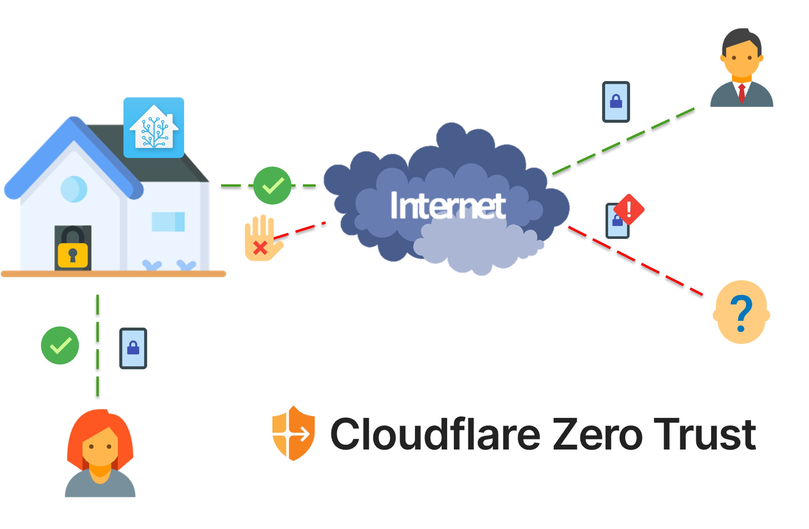

## 3. Regulations and standards

The following international, European, and Swiss regulations, standards and publications have been considered during the development of the system to provide a secure, reliable infrastructure to the users, the services, and the IoT devices connected to the system.

- NIST Cybersecurity Framework v1.1 - April 2018
- IoTSF: Secure Design - Best Practice Guides - 2 November 2019
- NISA: Baseline Security Recommendations for IoT in the context of Critical Information Infrastructures - 20 November 2017
- Ordinance on Protection against Cyber Risks in the Federal Administration (Switzerland) - 1 April 2021
- ICT minimum standard (Switzerland) - 27 August 2018

In addition to the regulations and standards listed above, the paper titled *Recommended Practices Guide for Securing ZigBee Wireless Networks in Process Control System Environments*, published by the *U.S. Department of Energy* has been considered to ensure the security of the ZigBee network.

## 4. System capabilities

The server comprises six key components, ensuring a secure and private environment for user data. Each component contributes to the robust architecture of the server.

Docker containers form the backbone of the system, offering secure, isolated application environments.

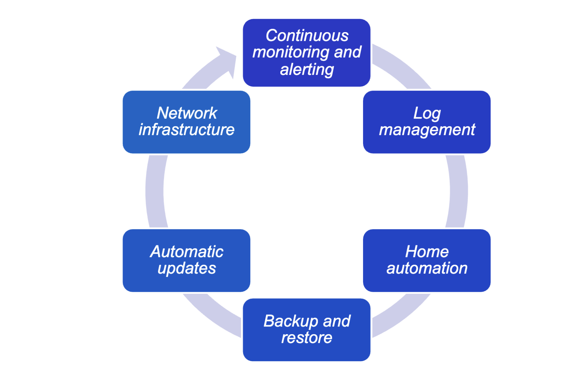

Each component is detailed below, elucidating the server's architecture.

### 4.1. Continuous monitoring and alerting system

The integration of [Prometheus](https://prometheus.io/) and [Grafana](https://grafana.com/) provides real-time system and Docker container monitoring. [Prometheus Alerts](https://prometheus.io/docs/alerting/latest/alertmanager/) trigger notifications upon exceeding predefined thresholds.

[Uptime Kuma](https://github.com/louislam/uptime-kuma) monitors application and service health, alerting via a configured Telegram bot during downtimes.

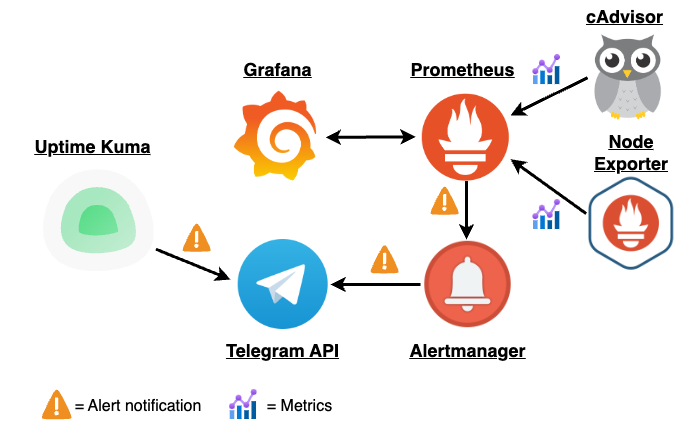

Grafana has been configured to provide two default dashboards, visualizing system and Docker container metrics collected by Prometheus. To learn more about the dashboards, refer to [Grafana Dashboards](./doc/grafana-dashboards.md).

#### 4.1.1. Alerting rules

Alerting rules are conditions evaluated periodically by *Prometheus* that whenever are met, it will trigger an alert via *Prometheus Alertmanager*. The alert manager will then notify the system administrators via the configured notification channels (i.e., Telegram, E-Mail, Slack).

The following list outlines the alerting rules configured to monitor the system health:

1. *Instance down*: triggers an alert when one of the core services of the monitoring suite (*Prometheus*, *Node Exporter* or *cAdvisor*) is down for more than 1 minute

2. *High disk usage*: triggers an alert when the disk usage of the host machine on ’/’ exceeds 80% for more than 10 minutes.

3. *High CPU usage*: triggers an alert when the CPU usage of the host machine exceeds 80% for more than 5 minutes.

4. *High network traffic*: triggers an alert when the inbound network traffic of the host machine exceeds 10Mb/s for the last minute.

5. *High CPU temperature*: triggers an alert when the CPU temperature of the host machine exceeds 70 °C for more than 1 minute.

*Telegram has been chosen as notification channel as it provides the most convenient solution. The individuals using the services hosted on the system might not have technical skills and might not be familiar with other platforms such as Slack or WeChat.*

#### 4.1.2. Service health monitoring

[Uptime Kuma](https://github.com/louislam/uptime-kuma) allows to monitor the status of the applications and services of the system and to receive real-time notifications when a service is down. The uptime check is performed by periodically sending requests (i.e. HTTP, TCP, ICMP) to the monitored targets and alerting the system administrator using the configured Telegram bot in case of failures.

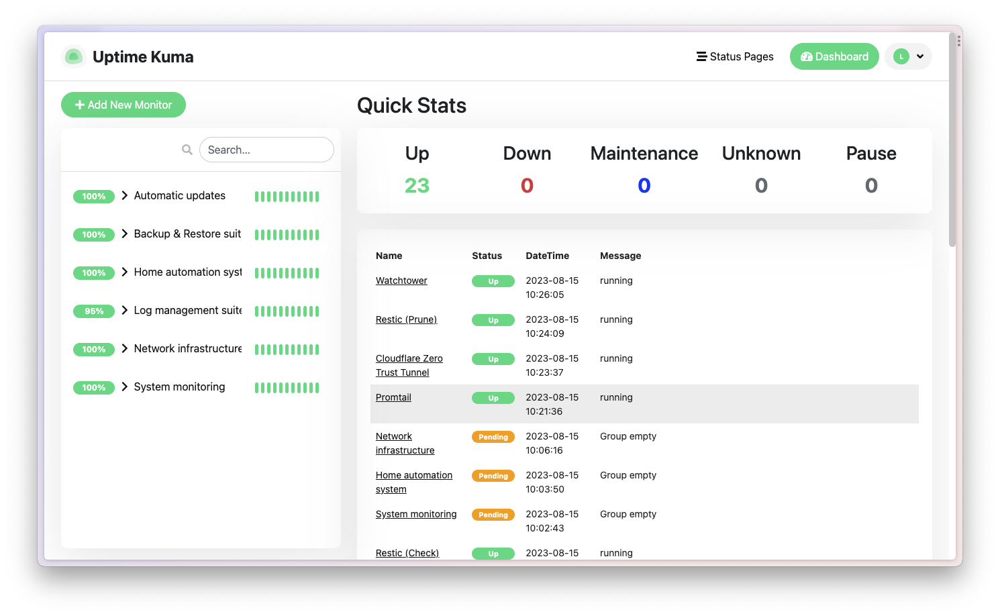

To learn more about how *Uptime Kuma* has been configured to perform its purpose, please refer to the file [Uptime Kuma service health monitoring](./doc/uptime-kuma-monitoring.md). On the other hand, an example of the notifications sent by *Uptime Kuma* can be found in the dedicated document [Monitoring suite - Telegram alerts examples](./doc/monitoring-telegram-alerts.md).

### 4.2. Log management suite

A log management solution has been implemented to centralize the collection, storage, and visualization of logs of the system services and Docker containers. The centralization of logs enables system administrators to access, query and visualize logs of different components of the system from a single interface, simplifying the process of troubleshooting and debugging of the system.

The following image illustrates the architecture of the log management suite.

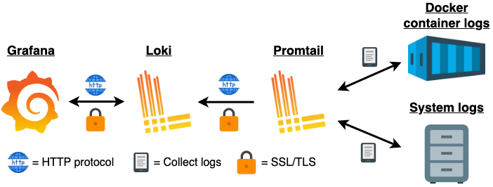

[Grafana Promtail](https://grafana.com/docs/loki/latest/send-data/promtail/) is configured to collect logs from the system and the running *Docker* containers and to send them to [Grafana Loki](https://grafana.com/oss/loki/) for storage and indexing. Stored logs can be queried via the *Explore* section of the Grafana web interface (yes, all out-of-the-box!). This is a sample screenshot of the result of a query:

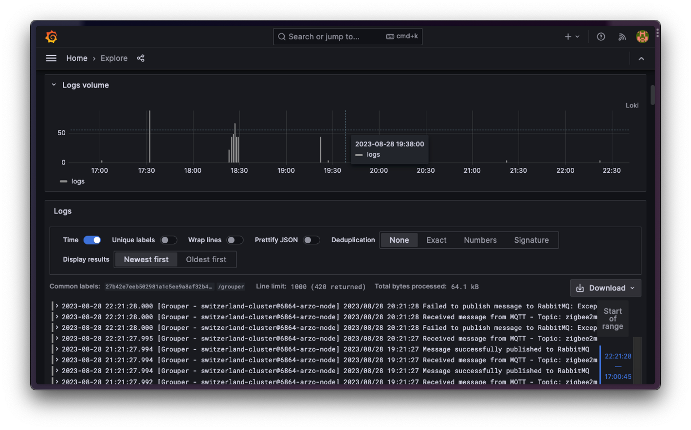

### 4.3. Backup and restore suite

To ensure data integrity in case of disasters such as hardware failures or physical damage, a robust backup solution has been implemented to periodically backup critical data stored in the system. The backup solution is based on [Restic](https://restic.net/), an open-source backup software that is fast, efficient and secure.

The use of a cloud storage solution like Amazon S3 (the one configured by default) is recommended as it provides a cheap and reliable solution to archive backups without incurring in disk capacity issues. It is important to highlight that the user can easily configure the backup solution to use a different cloud storage provider (i.e., Google Cloud Storage, Azure Blob Storage, etc.) or a local storage solution (i.e., NAS, external hard drive, etc.) (read official documentation [here](https://restic.readthedocs.io/en/latest/030_preparing_a_new_repo.html)).

The following image illustrates the architecture of the backup and restore suite.

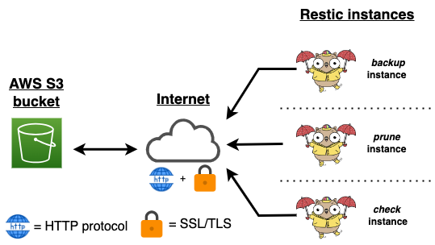

In the figure above is possible to notice that are present three different instances of Restic, all running at the same time. Each instance has a different purpose and is configured to perform specific tasks at specific times:

1. **backup instance**: configured to perform daily backups of the Docker volumes (every day at midnight). To guarantee data confidentiality, backups are encrypted before being sent to the cloud storage.

2. **restore instance**: in charge of cleaning up the S3 bucket by removing old backups based on the configured retention policies (refer to the next section for more details).

3. **check instance**: is responsible for verifying the integrity of the backup repository stored in the S3 bucket. This operation is executed on a daily basis (every day at 5:15 AM, 1h15m after the prune operation). The check process consists in analyzing 10% of the total data stored in the cloud storage, ensuring the reliability and integrity of the backups.

#### 4.3.1. Backup retention policies

Retention policies play a pivotal role in maintaining an optimal number of backups while ensuring older backups are systematically purged upon reaching set limits. The following retention policies have been configured:

- Retain the most recent seven daily backups
- Preserve the last four weekly backups
- Maintain the latest twelve monthly backups

#### 4.3.2. Backup notifications

Leveraging Telegram APIs, Restic *backup instance* is able to notify administrators when a backup operation is completed, when it fails (i.e., S3 bucket unavailable) and when it has been interrupted (i.e., one or more files are unreadable).

The following image shows all the possible notifications sent by the backup instance.

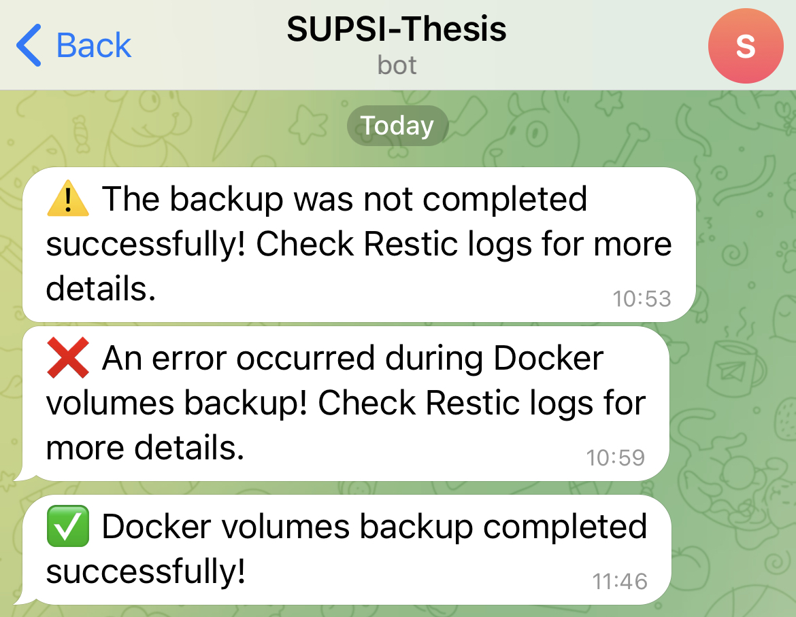

#### 4.3.3. Backup and restore operations via CLI

To simplify the backup and restore operations, a Makefile script has been developed to automate the backup and restore procedures as much as possible.

The following commands are available:

- **make backup**: creates a new incremental backup of the *Docker* volumes and sends it to the S3 bucket.

- **make restore**: wizard to restore the system from a backup selected by the user from the list of available backups. After the backup is performed, it will check the integrity of the restored data to ensure the integrity of the restored data.

*Note: it is important to note that the **restore** command first shuts down all running Docker containers, then restores the selected backup, and finally restarts all containers to ensure the integrity of the data.*

### 4.4. Home automation system

The integrated home automation system seamlessly integrates with [Home Assistant](https://www.home-assistant.io/), offering native support for a wide array of IoT devices right out of the box, including:

- ZigBee devices
- Ethernet devices
- Wi-Fi devices
- Bluetooth devices

The following image shows the architecture of the implemented home automation system:

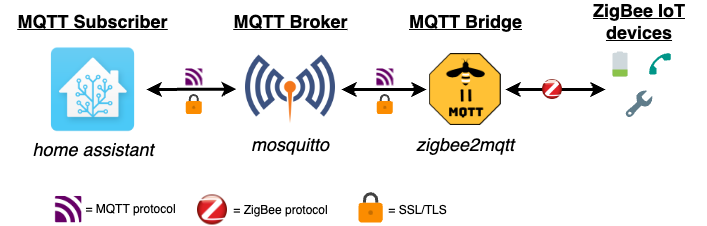

To support ZigBee devices, additional two software components have been added to the system:

- [ZigBee2Mqtt](https://www.zigbee2mqtt.io/): is a software bridge that allows to integrate ZigBee devices with MQTT. It implements a ZigBee to MQTT bridge, which allows ZigBee devices to communicate with MQTT. The bridge automatically maps physical devices to MQTT topics. It also supports per-device settings, allowing to set a friendly name for each device.

- [Eclipse Mosquitto](https://mosquitto.org/): is an open-source message broker that implements the MQTT protocol. It is responsible for receiving messages from Zigbee2MQTT and forwarding them to Home Assistant via MQTT.

*Note: to be able to use the ZigBee devices, the user needs to have a ZigBee USB dongle. The recommended one is the [Sonoff ZigBee 3.0 USB Dongle Plus](https://sonoff.tech/product/gateway-and-sensors/sonoff-zigbee-3-0-usb-dongle-plus-p/)*

Since connecting ZigBee devices to Home Assistant requires some additional configuration, a dedicated document has been created to guide the user through the process. Refer to the [ZigBee devices pairing tutorial](./doc/zigbee-pairing-tutorial.md) for more details.

#### 4.4.1. Secure communication using TLS certificates

To secure the communication between the MQTT broker, the MQTT bridge and the home automation software instance, TLS encryption and authentication has been implemented. This configuration ensures that only clients providing a valid TLS certificate (a certificate signed with the CA certificate) can establish a connection and communicate with the other components of the chain. All messages exchanged between the three instances are encrypted using the TLS protocol thus mitigating the risk of man-in-the-middle (MITM) attacks and ensure the integrity and confidentiality of the transmitted data (i.e., messages cannot be altered during the transmission).

The generation and distribution of the TLS certificates and keys to the three instances have been added to the configuration script, avoiding the need for manual configuration.

With the developed configuration, Zigbee2MQTT and Mosquito have TLS authentication and encryption enabled by default, loading the required certificates and keys during startup.

> **Important note**: [Home Assistant’s MQTT integration](https://www.home-assistant.io/integrations/mqtt/) requires manual configuration via GUI, as it does not allow TLS certificates to be configured through the config file.

#### 4.4.2. ZigBee network security

As the IoT network developed in this project is deployed in a non-critical setting where the system administrators might have limited budget and technical knowledge to properly manage the
system, the use of a dedicated *ZigBee Trust Center* (ZTC) has not been considered as it would have required additional hardware and efforts to configure and maintain.

> Depending on the firmware of the ZigBee adapter, different security measures could be implemented. For example, the firmware shipped with the Sonoff ZigBee 3.0 USB Dongle Plus supports the following security measures:
>
> - **IEEE 802.15.4 security services**: the ZigBee protocol is based on the IEEE 802.15.4 standard, which provides security services such as encryption, authentication, and integrity. The ZigBee protocol implements these security services to ensure the security of the ZigBee network.
>
> - **ZigBee link keys**: the link key is a 128-bit (16-byte) session key used to secure communications between two devices on the network. This key is unique and shared only between the two devices involved in the communication.

To have a baseline level of security, the *Zigbee2MQTT* instance has been configured to enable the following security measures:

- **Network data encryption**: all data exchanged between the *ZigBee End Devices* (ZEDs) and the ZigBee Coordinator is encrypted using a random network key generated by Zigbee2MQTT at startup

- **Access Control List (ACL)**: From the web interface is possible to open a joining window (i.e., 60 seconds) during which new devices can join the network and be added to the ACL. After the window expires, the joining of new devices is disabled, allowing only the devices in the ACL to connect the network. The GUI provide options to manage the Access Control List. For example, is possible to add or remove specific nodes from the ZigBee network.

### 4.5. Automatic updates

In a production environment, it is critical to keep the system and all the installed packages up to date with the latest security patches and updates to ensure the security and availability of the infrastructure. In the following section is presented the approach used to automate the update process of the system and the Docker containers running on the system.

#### 4.5.1. System updates

To ensure the security of the system, it is critical to keep the operating system and all the installed packages up to date with the latest security patches. This operation is usually done manually by the system administrator(s), requiring extra time and effort to keep the system up to date.

To solve this problem, the system configuration script installs and configure the [unattended-upgrades](https://wiki.debian.org/UnattendedUpgrades) package, a tool that allows to systematically install security patches and updates without the need for user intervention. This approach guarantees the security and stability of the system, while reducing the time and effort required to keep the system up to date.

#### 4.5.2. Docker image updates

Given the virtualized nature of the system infrastructure, it is critical to keep Docker containers up to date with the latest security patches and updates. Similar to system updates, this can be done either manually by administrators or autonomously using dedicated tools that periodically check for new image versions and update running containers.

To automate this process, the tool [Watchtower](https://github.com/containrrr/watchtower) has been selected due to its simplicity to deploy and use. This containerized tool periodically scans the running containers for out- dated images and based on the specified configuration, updates containers with the latest available image version (if any).

Notably, this tool automatically restarts updated containers using the new image, ensuring the latest version of the image is always running. This is a critical feature as it allows to maintain the previous container configuration to prevent breaking changes.

The *Watchtower* container has been configured to check for new versions of the images every 24 hours. After every cycle, a full report is generated and sent to the system administrator via Telegram. This is a screenshot of the update report sent by *Watchtower*:

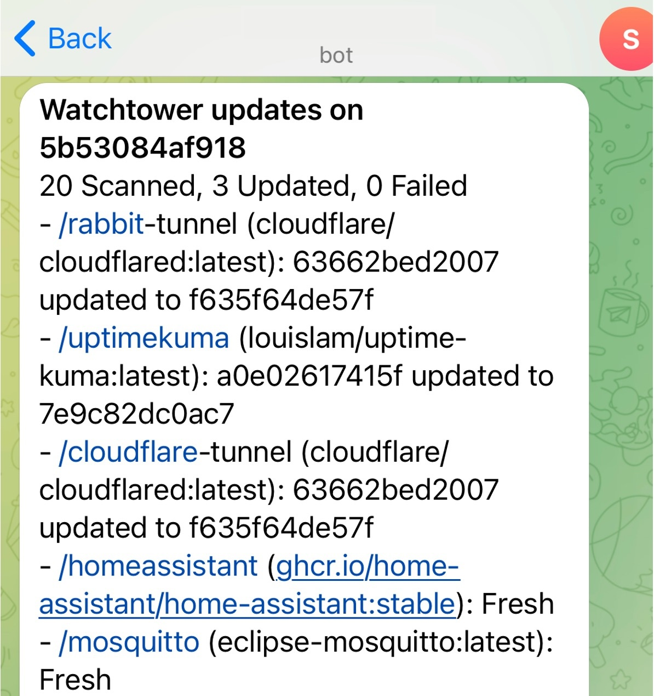

### 4.6. Network infrastructure

#### 4.6.1. DNS Server

As exposed services are behind a reverse proxy, it is necessary to configure a DNS server to resolve the domain names of the services hosted on the server. To address these requirements, the open-source DNS server [BIND9](https://www.isc.org/bind/) has been used. BIND9 is the most widely used DNS server software, that provides a robust and stable platform on top of which organizations can build distributed computing systems fully compliant with published DNS standards.

Based on the domain name specified in the configuration file prior to the deployment of the system, the DNS server will be configured with a specific zone file that maps the domain name to the IP address of the server via a wildcard record. This allows to easily add new services to the system without the need to manually configure the DNS server.

To enhance security, the DNS server has been configured to only accept queries from the internal network, thus preventing external users from querying the DNS server. To limit even more the attack-surface DNSSEC enabled to provide authentication and integrity to the DNS responses.

#### 4.6.2. Reverse proxy

To provide an additional layer of security to the system and to simplify the exposure of internal services to the LAN (i.e., Home Assistant dashboard), the reverse proxy [Traefik](https://traefik.io/traefik/) has been implemented.

Traefik is a modern HTTP reverse proxy and load balancer written in Go, designed specifically for *dockerized* environments. It is a lightweight and easy to use solution that provides advanced features such as automatic SSL certificate generation and renewal, HTTP/2 sup- port, load balancing and circuit breakers.

The choice of Traefik is motivated by its key feature: its ability to automatically discover containers and dynamically update its configuration, allowing to easily expose securely new system services without ever touching configuration files. This enhances the extensibility of the system, allowing to easily add new services without breaking the existing ones.

##### 4.6.2.1. SSL certificate generation and renewal for internal domain names

If the user has a domain name registered on Cloudflare, it is possible to leverage the Cloudflare API to automatically generate and renew SSL certificates for the internal domain names used by the system without exposing them to the internet. This approach allows to easily add new services to the system without the need to manually generate and renew SSL certificates.

This process is fully automated and requires no user intervention. For more details about the implementation of this feature, please refer to the official Traefik documentation [here](https://doc.traefik.io/traefik/https/acme/#dnschallenge).

## 5. Exposing services to the internet securely via Cloudflare Tunnel

To avoid the need to open ports in both the router and the server firewalls, is possible to leverage the services offered by [Cloudflare’s SSE & SASE Platform](https://www.cloudflare.com/zero-trust/). This platform offers a set of security services to facilitate the secure access to internal services and resources, one of these services is [Cloudflare Tunnel](https://www.cloudflare.com/products/tunnel/).

This solution allows to expose internal services to the internet without opening ports in the router and the server firewalls, thus reducing the attack surface of the system. Additionally, this approach allows to leverage the Cloudflare edge network to protect the exposed services from DDoS attacks and other malicious traffic. The following diagram illustrates the architecture of the system when Cloudflare Tunnel is enabled.

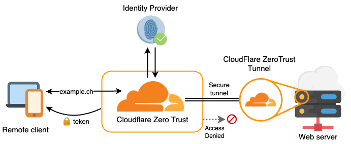

## 6. Secure remote access to the system via Cloudflare Access and Cloudflare WARP

The same platform used to expose services to the internet securely can be used to provide secure remote access to the system. Via [Cloudflare Tunnel](https://www.cloudflare.com/products/tunnel/), [Cloudflare Access](https://www.cloudflare.com/zero-trust/products/access/) and [Cloudflare WARP](https://developers.cloudflare.com/cloudflare-one/connections/connect-devices/warp/download-warp/), it is possible to implement a secure remote access solution that allows to access the system from anywhere in the world without ever exposing the system to the internet, while keeping the system security posture high.

By configuring a *split tunnel* in the Zero Trust network, it is possible to route all the traffic destined to the internal network through the secure tunnel created by Cloudflare Tunnel, while all the other traffic will be routed through Cloudflare data centers: this approach allows to leverage the Cloudflare edge network to protect the system from DDoS attacks and other malicious traffic.

This is a diagram that depicts the architecture of the system when with a split tunnel configuration.

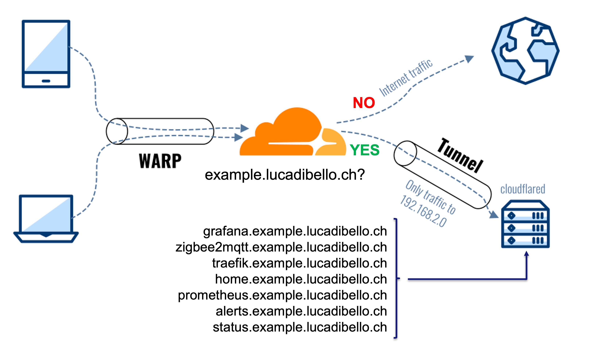


#### 6.0.1. Security features

To ensure the security and privacy of both the remote connection to the private infrastructure and the internal services exposed to the Internet, the following security features should be enabled in the *Zero Trust* organization:

##### 6.0.1.1. Tunnel monitoring and alerting

Cloudflare Notifications enable system administrators to receive real-time E-Mail alerts when a specific event occurs. To ensure the security and privacy of the infrastructure and the data stored in it, the following notifications
should be enabled:

1. **Cloudflare Tunnel health status changes**: the system administrator(s) are notified when the tunnel health status changes (i.e., tunnel is down, tunnel is up). This feature
allows for a quick response to any potential issue and ensures the availability of the tunnel.

1. **HTTP DDoS attack detection**: an alert is triggered when an *HTTP Distributed Denial of Service* (DDoS) attack is detected. Even if Cloudflare provides already automatic DDoS attack mitigation, this notification can be useful to alert system administrator(s) of an attack and allow them to take further actions if necessary.

3. **Route Leak Detection alert**: an alert is triggered when a *Route Leak* attack (learn more [here](https://blog.cloudflare.com/route-leak-detection/)) is detected. This alert allows the system administrator(s) to detect potential misconfigurations in the tunnel routing and enables them to quickly respond to the incident.

##### 6.0.1.2. Logging and monitoring of tunnel usage and user activity

Via *Cloudflare Zero Trust* settings, is possible to enable logging and monitoring for tunnel usage and user activity. To allow system administrators a global view of the Zero Trust network, the following logs should be enabled:

- *Admin activity logs*: these logs track the creation, deletion, and configuration changes within the Zero Trust organization, including details about the user responsible for each action.

- *Access authentication logs*: these logs keep a record of the authentication attempts and activities such as login attempts and device enrollments of users and services within the Zero Trust organization.

- *Device posture logs*: these logs keep track of the device posture status of devices connected to the Zero Trust organization. To learn more about the advised device posture checks, refer to the next section.

- *Gateway activity logs*: these logs record the network packets, HTTP and DNS requests inspected by the Zero Trust Gateway. Encrypted SSH command logs for sessions proxied by the Zero Trust Gateway are also available for download and can be
decrypted using the private key generated during the SSH command logging configuration.

##### 6.0.1.3. Device posture checks

Device posture checks allows system administrators to assess the well-being of devices connected to the Zero Trust network, allowing only healthy devices to access network resources and services. The following posture checks should be configured:

- **Firewall**: ensures the device’s firewall is enabled and properly configured.

- *OS Version*: validates that the device is running the latest major version of the operating system. This check is useful to ensure that the device is not running outdated software that could contain known vulnerabilities, highly increasing the risk of a successful cyberattack. These are the configured operating systems along with the minimum required version:

  - *Windows*: Windows 11 or later
  - *macOS*: macOS Ventura or later
  - *Linux*: Ubuntu 22.04 (*as example*), kernel 5.15.0 or later
  - *iOS and ipadOS*: iOS/ipadOS 16 or later
  - *Android*: Android 13 or later

With this configuration is possible to limit access to the network to only up-to-date and healthy devices, reducing the risk of a successful cyberattack.

##### 6.0.1.4. File antivirus inspection

Files passing through the Zero Trust network, both
downloading and uploading, are scanned for viruses and malware using the layer 7 Zero Trust network firewall. This functionality ensures the identification and prevention of malware and viruses from entering the network, reducing the risk of data breaches and cyberattacks.

##### 6.0.1.5. Geolocation restrictions

To reduce the potential attack surface of the Zero Trust network, access to the network can be confined to specific countries (i.e. limiting access to the network to only the country where the system administrators are located).

By enabling access geolocation restriction is possible to reinforce the security posture of the Zero Trust network introducing an additional layer of defense

## 7. Software firewall

By employing a software firewall is possible to get control over incoming and outgoing traffic, preventing unauthorized access connections to and from the system and its services. To address this requirement, the built-in tool [iptables](https://linux.die.net/man/8/iptables) has been employed.

To adhere to the Zero Trust security model, the firewall have been configured to deny all inbound and outbound traffic by default and only allow traffic to pass through the secure tunnel created by Cloudflare Tunnel, which is accessible only to authorized users and devices.

The script in charge of configuring the firewall can be found [here](./scripts/firewall/zero-trust-firewall.sh).

## 8. System extensibility and additional services

To showcase the extensibility of the implemented system, the following services have been added to the system:

- [Vaultwarden](https://github.com/dani-garcia/vaultwarden), a self-hosted password manager compatible with the Bitwarden clients.
- [Nextcloud](https://nextcloud.com/), a self-hosted cloud storage solution that allows to store and share files, manage calendars, contacts, and more.
- [Personal website](https://lucadibello.ch/) to showcase how to host custom services on the server.

## 9. System hardening measures

This section outlines the measures implemented to enhance system security, effectively reducing the attack surface of the system.

All the listed measures have been implemented in the system configuration script, thus requiring no user intervention.

### 9.1. Disable core dumps

A core dump is a file containing a process’s address space when it terminates unexpectedly. This file can be used to debug the process and identify the cause of the crash. However, attackers leverage this file to extract sensitive information, such as passwords and encryption keys. For this reason, it is critical to disable core dumps to prevent attackers from extracting sensitive information from the system memory.

Learn more about core dumps [here](https://en.wikipedia.org/wiki/Core_dump).

### 9.2. Authentication and password policies

To ensure the security of the system, it is critical to enforce strong password policies to prevent attackers from guessing user passwords. These are the password policies enforced on the system to guarantee its security:

- Increased number of hashing rounds in `/etc/login.defs`(`SHA_CRYPT_MIN_ROUNDS` from `5000` to `10000`)
- Installed PAM module `pam_cracklib` to enforce strong passwords
- Set minimum number of days allowed between password changes (`PASS_MIN_DAYS` from `0` to `1` days)
- Set maximum number of days allowed to keep the same password (`PASS_MAX_DAYS` from `0` to `90` days)

Enforcing strong passwords reduces the risk of successful cyberattacks.

### 9.3. Change default UMASK permissions

The default *umask* permissions are 022 (0022 in octal notation), which means that newly created files and directories will have the following permissions:

- Files: 644 (-rw-r--r--)
- Directories: 755 (drwxr-xr-x)

The default *umask* value is too permissive and can lead to security issues. For this reason, it is critical to change the default *umask* permissions to 027 (0027 in octal notation), which means that newly created files and directories will have the following permissions:

- Files: 640 (-rw-r-----)
- Directories: 750 (drwxr-x---)

By setting these permissions, it is possible to ensure that only the owner of the file or directory can read and write to it, while others in the same group can only list the directory contents.

### 9.4. Disable unused kernel modules

The system comes with a set of kernel modules that are not necessary for the system to function properly. As kernel modules can be exploited by attackers to gain access to the system, it is critical to removed unused ones to reduce the attack surface.

This are the modules that have been removed from the system:

- `dccp`
- `sctp`
- `rds`
- `tipc`

### 9.5. SSH service hardening

The SSH server is the only service installed on the system that is not running in a Docker container. For this reason, it is critical to harden this service to prevent unauthorized access to the system. In the following section are presented the measures implemented to harden the SSH service.
To further harden the SSH service, the following configuration changes have been made:

- Disable SSH port forwarding (`AllowTcpForwarding` from `yes` to `no`)
- Lower the maximum alive SSH sessions (`ClientAliveCountMax` from `3` to `2`)
- Increase SSH service verbosity (`LogLevel` from `INFO` to `VERBOSE`)
- Lower the maximum authentication attempts (`MaxAuthTries` from `6` to `3`)
- Lower the maximum number of open SSH sessions (`MaxSessions` from `10` to `2`)
- Change root login permissions (`PermitRootLogin` from `yes` to one of the following options: `FORCED-COMMANDS-ONLY`, `NO`, `PROHIBIT-PASSWORD`, `WITHOUT-PASSWORD`)
- Disable TCP keepalive (`TCPKeepAlive` from `yes` to `no`)
- Disable SSH X11 forwarding (`X11Forwarding` from `yes` to `no`)
- Disable SSH agent forwarding (`AllowAgentForwarding` from `yes` to `no`)

### 9.6. Legal notice banner

Adding a legal notice banner to the system is a good practice as it informs users that the system is private and unauthorized access is prohibited. The banner is displayed when a user logs in to the system via SSH.

This is the banner that has been added to the system:

```text
This system is private. Unauthorized access is prohibited.
```

While this is not a security measure, it is a good practice to inform users that the system is private, and that unauthorized access is not allowed.

### 9.7. System auditing

System audits allow system administrators to discover security violations and find relevant security information. By configuring [auditd](https://linux.die.net/man/8/auditd) service on the system is possible to record triggered system events. The information included in the audit logs can be leveraged to learn what configuration caused the problem, enabling administrators to enhance the system cybersecurity posture. This service logs system events to the `/var/log/audit/audit.log` file based on a comprehensive set of rules (i.e., file system events, system calls, etc.).

The set of rules provided by default is the following: [audit.rules](https://raw.githubusercontent.com/Neo23x0/auditd/master/audit.rules).

### 9.8. Kernel hardening

The Linux kernel comes with a set of parameters that can be configured to enhance the security of the system. In the following section are presented the measures implemented to harden the system kernel parameters.

This is the script in charge of hardening the system kernel parameters:

```bash
echo "kernel.dmesg_restrict = 1" | sudo tee -a /etc/sysctl.d/80-lynis.conf
echo "kernel.sysrq = 0" | sudo tee -a /etc/sysctl.d/80-lynis.conf
echo "net.ipv4.conf.all.accept_redirects = 0" | sudo tee -a /etc/sysctl.d/80-lynis.conf
echo "net.ipv4.conf.all.log_martians = 1" | sudo tee -a /etc/sysctl.d/80-lynis.conf
echo "net.ipv4.conf.all.send_redirects = 0" | sudo tee -a /etc/sysctl.d/80-lynis.conf
echo "net.ipv4.conf.default.accept_redirects = 0" | sudo tee -a /etc/sysctl.d/80-lynis.conf
echo "net.ipv4.conf.default.log_martians = 1" | sudo tee -a /etc/sysctl.d/80-lynis.conf
```

### 9.9. Restrict compilers to root users

Compilers are tools that allow to transform source code into executable code. Attackers can use these tools to compile malicious code and run it on the system. For this reason, it is critical to restrict the usage of compilers to root users only.

The script will look for the following compilers (wildcards are used to match all versions of the compiler) and restrict their usage to root users only:

- `gcc*`
- `g++*`
- `cc*`
- `c++*`

## 10. Testing the system

### 10.1. Hardware

The system has been tested successfully on the following low-end single-board computers both running [Armbian](https://www.armbian.com/):

- [Orange Pi Win Plus](http://www.orangepi.org/html/hardWare/computerAndMicrocontrollers/details/Orange-Pi-WinPlus.html): 2 GB DDR3L SDRAM, Quad-core ARM Cortex-A53 (64-bit) @ 1.2 GHz, MicroSD (max 32 GB) and eMMC module slot, Gigabit Ethernet, Wi-Fi with dedicated antenna (IEEE 802.11 b/g/n) and Bluetooth connectivity (BT4.2).

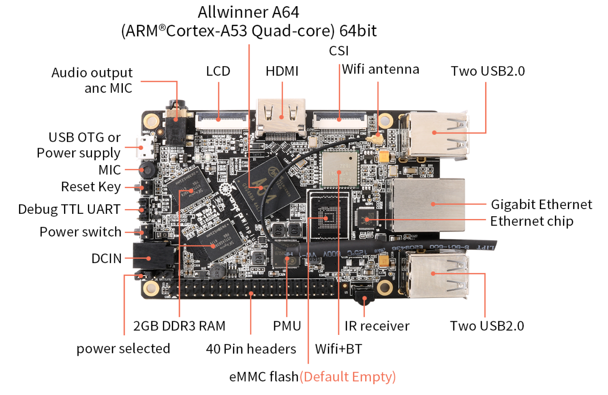

*[Image source](http://www.orangepi.org/html/hardWare/computerAndMicrocontrollers/details/Orange-Pi-PC.html)*

- [Banana Pi BPI-64](https://wiki.banana-pi.org/Banana_Pi_BPI-M64): 2 GB LPDDR3 SDRAM, Quad-Core ARM Cortex-A53 (64-bit) @ 1.2 GHz, MicroSD and eMMC module (8 GB), Gigabit Ethernet, Wi-Fi, and Bluetooth connectivity.

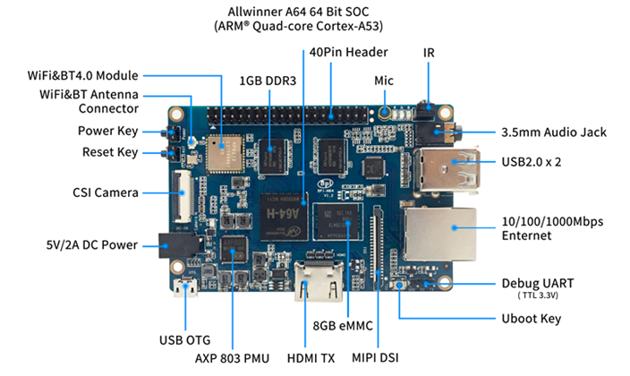

*[Image source](https://wiki.banana-pi.org/Banana_Pi_BPI-M64)*

### 10.2. Security tests

To test the security of the system, the following tools have been used:

- [Lynis](https://cisofy.com/lynis/): an open-source security auditing tool that performs a comprehensive security scan of the system, providing a detailed report of the security issues found and recommendations to fix them.
- [OpenVAS](https://www.openvas.org/): an open-source vulnerability scanner that performs a comprehensive vulnerability scan of the system, providing a detailed report of the vulnerabilities found and recommendations to fix them.
- [NMap](https://nmap.org/): an open-source network scanner that performs a comprehensive scan of the system, providing a detailed report of the open ports found and recommendations to fix them.

The system hardening measures implemented in the system configuration script have been tested using the tools listed above. Globally, the system has been rated as secure by the tools, with a few minor issues that have been fixed later in the development process.

## 11. Summary of the system architecture

This section provides a concise overview of the implemented home automation system. The provided summary tables highlight key aspects like software components, running services, Docker containers, and network configuration.

The information is particularly valuable as it offers a comprehensive view of the implemented infrastructure. In fact, in just a few pages the reader can grasp how distinct parts of the system work together. The details related to created Docker networks also show how different services are connected to each other, providing a better understanding of the overall system
architecture and the measures implemented to protect it. Refactoring of IT projects to increase security, safety and privacy

### 11.1. System services

The following table outlines the services used to build the current infrastructure. The table provides key information about each component, including the name, description, whether the component is virtualized using Docker, the DNS name used by the reverse proxy, and port used by the service to communicate with other components.

| Component | Description | Dockerized | DNS Name | Port |
| --------- | ----------- | ---------- | -------- | ---- |
| **Network infrastructure** |
| BIND9 | nternal DNS resolver for domain name resolution | Yes | - | 53 |
| Traefik | Reverse proxy and load balancer | Yes | traefik.your.domain | 80, 443 |
| Cloudflare Tunnel | Encrypted tunnel to expose internal service to the Internet using Cloudflare | No | - | 443 |
| Cloudflare Zero Trust Network Access | Zero Trust network for controlling lights and appliances | No | - | - |
| IPTables | Software firewall to filter inbound and outbound traffic | No | - | - |
| **Continuous system monitoring and alerting** |
| Prometheus | Metric collection and storage system | Yes | prometheus.your.domain | 9090 |
| Node Exporter | Exports system metrics for Prometheus | Yes | - | 9100 |
| cAdvisor | Exports Docker containers metrics for Prometheus | Yes | - | 8080 |
| Grafana | Data visualization and alerting system | Yes | grafana.your.domain | 3000 |
| Uptime Kuma | Dashboard and visualization platform to view the collected metrics and logs | Yes | status.your.domain | 3001 |
| Prometheus Alertmanager | Prometheus alert manager to send alerts to system administrator(s) | Yes | alerts.your.domain | 9093 |
| **Home automation system** |
| Mosquitto | MQTT broker for controlling lights and appliances | Yes | - | 1883 |
| Zigbee2MQTT | Bridge for connecting ZigBee devices to MQTT broker | Yes | zigbee2mqtt.your.domain | 8080 |
| Home Assistant | Home automation platform for controlling lights and appliances | Yes | home.your.domain | 8123 |
| **Backup and restore** |
| Restic | Backup and restore software | Yes | - | - |
| **Log management** |
| Grafana Loki | Log aggregation system to collect and store logs | Yes | - | 3100 |
| Grafana Promtail | Loki log collector (agent) | Yes | - | 9080 |
| **Automatic updates** |
| Watchtower | Automatic Docker images updates | Yes | - | - |
| Unattended-upgrades | Automatic system updates and security patches  | No | - | - |

### 11.2. Docker external networks

The following table outlines the external Docker networks created to implement the system architecture. The table provides information about the network name, IP range and purpose.

| Network name | IP range | Description |
| ------------ | -------- | ----------- |
| `bridge` | `172.17.0.0/16` | Default Docker network used for connecting individual containers to the host|
| `traefik-network` | `172.18.0.0/16` | Docker network connected to all containers exposed via Traefik reverse proxy |
| `loki-network` | `172.19.0.0/16` | Docker network shared with all containers part of the log management system |
| `prometheus-network` | `172.20.0.0/16` | Docker network shared with all containers part of the system monitoring suite |
| `home-network` | `172.21.0.0/16` | Docker network shared with all containers part of the home automation system |

### 11.3. Docker container list

The following table lists all information about the containers used by the server.

| Container name | Image | Network | Restart policy |
| -------------- | ----- | ------- | -------------- |
| `bind9` | `ubuntu/bind9:latest` | `traefik-network` | `always` |
| `traefik` | `traefik:latest` | `traefik-network` | `always` |
| `cloudflare-tunnel` | `cloudflare/cloudflared:latest` | `traefik-network` | `always` |
| `prometheus` | `prom/prometheus:latest` | `traefik-network`, `prometheus-network` | `always` |
| `node-exporter` | `quay.io/prometheus/node-exporter:latest` | `traefik-network`, `prometheus-network` | `always` |
| `cadvisor` | `gcr.io/cadvisor/cadvisor:latest` | `prometheus-network` | `always` |
| `grafana` | `grafana/grafana-oss:latest` | `traefik-network`, `prometheus-network` | `always` |
| `uptimekuma` | `louislam/uptime-kuma:latest` | `traefik-network`, `prometheus-network`, `home-network`, `loki-network` | `always` |
| `alertmanager` | `prom/alertmanager:latest` | `traefik-network`, `prometheus-network` | `always` |
| `mosquitto` | `eclipse-mosquitto:latest` | `home-network` | `always` |
| `zigbee2mqtt` | `koenkk/zigbee2mqtt:latest` | `traefik-network`, `home-network` | `always` |
| `homeassistant` | `ghcr.io/home-assistant/home-assistant:stable` | `traefik-network`, `home-network` | `always` |
| `restic` | `mazzolino/restic:latest` | `bridge` | `always` |
| `loki` | `grafana/loki:latest` | `traefik-network`, `loki-network` | `always` |
| `promtail` | `grafana/promtail:latest` | `loki-network` | `always` |
| `watchtower` | `containrrr/watchtower:latest` | `bridge` | `always` |

### 11.4. Docker containers network segmentation

The following diagram shows the network segmentation of the Docker containers used by the server.

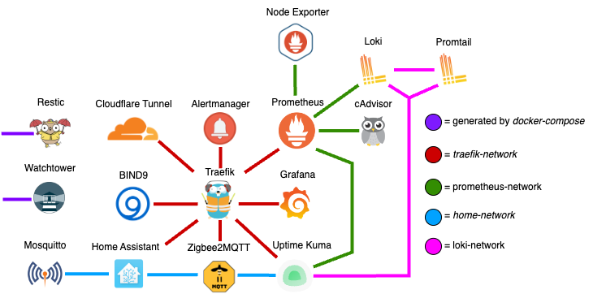