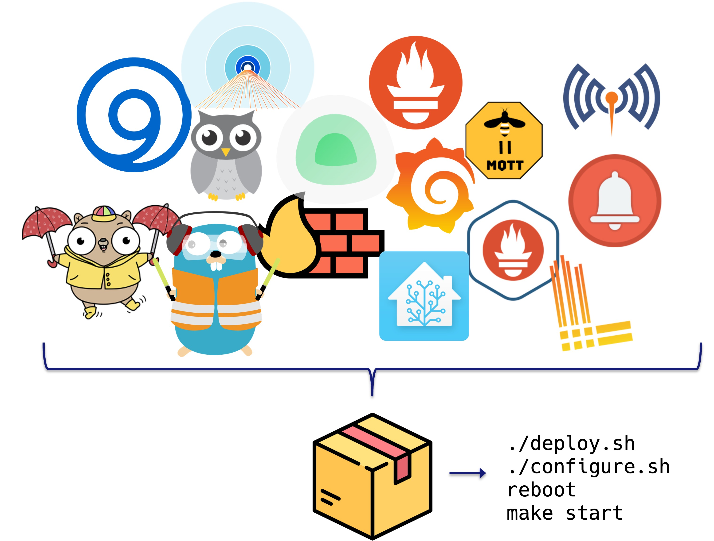

# ZeroTrust Your Home - A safe and private environment for you and your data<!-- omit in toc -->



## Table of contents<!-- omit in toc -->

- [1. Motivation](#1-motivation)
- [2. Project description](#2-project-description)
- [3. System capabilities](#3-system-capabilities)
  - [3.1. Continuous monitoring and alerting system](#31-continuous-monitoring-and-alerting-system)
    - [3.1.1. Alerting rules](#311-alerting-rules)
    - [3.1.2. Service health monitoring](#312-service-health-monitoring)
  - [3.2. Log management suite](#32-log-management-suite)
  - [3.3. Backup and restore suite](#33-backup-and-restore-suite)
    - [3.3.1. Backup retention policies](#331-backup-retention-policies)
    - [3.3.2. Backup notifications](#332-backup-notifications)
    - [3.3.3. Backup and restore operations via CLI](#333-backup-and-restore-operations-via-cli)
  - [3.4. Home automation system](#34-home-automation-system)
    - [3.4.1. Secure communication using TLS certificates](#341-secure-communication-using-tls-certificates)
  - [3.5. Automatic updates](#35-automatic-updates)
    - [3.5.1. System updates](#351-system-updates)
    - [3.5.2. Docker image updates](#352-docker-image-updates)
  - [3.6. Network infrastructure](#36-network-infrastructure)
    - [3.6.1. DNS Server](#361-dns-server)
    - [3.6.2. Reverse proxy](#362-reverse-proxy)
      - [3.6.2.1. SSL certificate generation and renewal for internal domain names](#3621-ssl-certificate-generation-and-renewal-for-internal-domain-names)
- [4. System extensibility and additional services](#4-system-extensibility-and-additional-services)
- [5. System hardening](#5-system-hardening)
  - [5.1. Disable core dumps](#51-disable-core-dumps)
  - [5.2. Authentication and password policies](#52-authentication-and-password-policies)
  - [5.3. Change default UMASK permissions](#53-change-default-umask-permissions)
  - [5.4. Disable unused kernel modules](#54-disable-unused-kernel-modules)
  - [5.5. SSH service hardening](#55-ssh-service-hardening)
  - [5.6. Legal notice banner](#56-legal-notice-banner)
  - [5.7. System auditing](#57-system-auditing)
  - [5.8. Kernel hardening](#58-kernel-hardening)
  - [5.9. Restrict compilers to root users](#59-restrict-compilers-to-root-users)
- [6. Testing the system](#6-testing-the-system)
  - [6.1. Hardware](#61-hardware)
  - [6.2. Security tests](#62-security-tests)
- [7. Additional resources](#7-additional-resources)
  - [7.1. Docker containers network segmentation](#71-docker-containers-network-segmentation)

## 1. Motivation

Information systems play an increasingly key role in our daily lives, in sectors as diverse as public services, healthcare, finance, industry and more. Ensuring the security and privacy of systems is of critical importance as it protects the data of users and the integrity of the systems themselves.

## 2. Project description

This project showcases an autoconfigured home server environment that provides a powerful and secure infrastructure that leverages cutting-edge technologies to ensure security, privacy, and ease of use. It provides the user with a set of pre-configured services and applications that can be easily extended and customized to meet the user's needs.

Employing [Cloudflare SSE & SASE Platform](https://www.cloudflare.com/zero-trust/#zt-features), the server adheres with the Zero Trust security model, in fact, to be able to access the services the user needs to be authenticated, authorized and the device security must be verified through automated posture checks.

The developed infrastructure has been designed to be easily extensible and customizable. In fact, a user can easily extend the server with additional services and applications without any additional configuration.

## 3. System capabilities

The server is based on six main components to provide a secure and private environment for the user data. In the following sections, each component will be described in detail to provide a better understanding of the server architecture.

The entire system is based upon [Docker](https://www.docker.com/) containers to leverage application virtualization, aiming to provide a secure and isolated environment for each application.


In the following sections, each component will be described in detail to provide a better understanding of the server architecture.

### 3.1. Continuous monitoring and alerting system

With a continuous monitoring solution system administrators can be notified in real-time when an issue is detected, allowing to respond quickly and effectively. For this purpose, the open-source monitoring solution [Prometheus](https://prometheus.io/) has been used in pair with [Grafana](https://grafana.com/) to collect and visualize metrics of the operating system and the various *Docker* containers.

To provide real-time notifications, [Prometheus Alerts](https://prometheus.io/docs/alerting/latest/alertmanager/) have been configured to trigger alerts when specific system metrics exceeds a predefined threshold.

While *Prometheus* is charge of monitoring the status of the system and the running containers, [Uptime Kuma](https://github.com/louislam/uptime-kuma) has been employed to monitor the health of the many applications and services running on the server.


*Note: Grafana has been configured to ship two custom dashboards via [provisioning](https://grafana.com/docs/grafana/latest/administration/provisioning/), out-of-the-box, without any additional configuration.*

#### 3.1.1. Alerting rules

For the purpose of this project, five alerting rules have been configured to monitor the health of the system and the running containers. Refer to the [Prometheus Alerting Rules](./doc/prometheus-alerting-rules.md) document for more details.

*Note: For the particular use case thought for this project, Telegram has been chosen as notification channel as it provides the most convenient solution. The individuals using the services hosted on the system are not expected to have technical skills and is not expected to have business accounts on other platforms such as Slack or WeChat.*

#### 3.1.2. Service health monitoring

[Uptime Kuma](https://github.com/louislam/uptime-kuma) allows to monitor the status of the applications and services of the system and to receive real-time notifications when a service is down. The uptime check is performed by periodically sending requests (i.e. HTTP, TCP, ICMP) to the monitored targets and alerting the system administrator using the configured Telegram bot in case of failures.


To learn more about how *Uptime Kuma* has been configured to perform its purpose, please refer to the file [Uptime Kuma service health monitoring](./doc/uptime-kuma-monitoring.md). On the other hand, an example of the notifications sent by *Uptime Kuma* can be found in the dedicated document [Monitoring suite - Telegram alerts examples](./doc/monitoring-telegram-alerts.md).

### 3.2. Log management suite

A log management solution has been implemented to centralize the collection, storage, and visualization of logs of the system services and Docker containers. The centralization of logs enables system administrators to access, query and visualize logs of different components of the system from a single interface, simplifying the process of troubleshooting and debugging of the system.

The following image illustrates the architecture of the log management suite.


[Grafana Promtail](https://grafana.com/docs/loki/latest/send-data/promtail/) is configured to collect logs from the system and the running *Docker* containers and to send them to [Grafana Loki](https://grafana.com/oss/loki/) for storage and indexing. Stored logs can be queried via the *Explore* section of the Grafana web interface (yes, all out-of-the-box!). This is a sample screenshot of the result of a query:


### 3.3. Backup and restore suite

To ensure data integrity in case of disasters such as hardware failures or physical damage, a robust backup solution has been implemented to periodically backup critical data stored in the system. The backup solution is based on [Restic](https://restic.net/), an open-source backup software that is fast, efficient and secure.

The use of a cloud storage solution like Amazon S3 (the one configured by default) is recommended as it provides a cheap and reliable solution to archive backups without incurring in disk capacity issues. It is important to highlight that the user can easily configure the backup solution to use a different cloud storage provider (i.e., Google Cloud Storage, Azure Blob Storage, etc.) or a local storage solution (i.e., NAS, external hard drive, etc.) (read official documentation [here](https://restic.readthedocs.io/en/latest/030_preparing_a_new_repo.html)).

The following image illustrates the architecture of the backup and restore suite.


In the figure is possible to notice that are present three different instances of *Restic* running at the same time. Each instance has a different purpose and is configured to perform specific tasks at specific times:

1. **backup instance**: configured to perform daily backups of the Docker volumes (every day at midnight). To guarantee data confidentiality, backups are encrypted before being sent to the cloud storage.

2. **restore instance**: in charge of cleaning up the S3 bucket by removing old backups based on the configured retention policies (refer to the next section for more details).

3. **check instance**: is responsible for verifying the integrity of the backup repository stored in the S3 bucket. This operation is executed on a daily basis (every day at 5:15 AM, 1h15m after the prune operation). The check process consists in analyzing 10% of the total data stored in the cloud storage, ensuring the reliability and integrity of the backups.

#### 3.3.1. Backup retention policies

Retention policies ensure the retention of a specific number of backups, while removing the oldest one as the limit is reached. These are the configured retention policies:

- Keep last seven daily backups
- Keep last four weekly backups
- Keep last twelve monthly backups

#### 3.3.2. Backup notifications

Leveraging Telegram APIs, Restic *backup instance* is able to notify administrators when a backup operation is completed, when it fails (i.e., S3 bucket unavailable) and when it has been interrupted (i.e., one or more files are unreadable).

The following image shows all the possible notifications sent by the backup instance.


#### 3.3.3. Backup and restore operations via CLI

To simplify the backup and restore operations, a Makefile script has been developed to automate the backup and restore procedures as much as possible.

The following commands are available:

- **make backup**: creates a new incremental backup of the *Docker* volumes and sends it to the S3 bucket.

- **make restore**: wizard to restore the system from a backup selected by the user from the list of available backups. After the backup is performed, it will check the integrity of the restored data to ensure the integrity of the restored data.

*Note: it is important to note that the restore command first shuts down all running Docker containers, then restores the selected backup, and finally restarts all containers to ensure the integrity of the data.*

### 3.4. Home automation system

$\textcolor{RED}{\text{WIP: Already implemented but not added to the project yet.}}$

The developed home automation system is based on [Home Assistant](https://www.home-assistant.io/) thus supporting out-of-the-box the following IoT devices:

- ZigBee devices
- Ethernet devices
- Wi-Fi devices
- Bluetooth devices

The following image shows the architecture of the implemented home automation system:


To support ZigBee devices, additional two software components have been added to the system:

- [ZigBee2Mqtt](https://www.zigbee2mqtt.io/): is a software bridge that allows to integrate ZigBee devices with MQTT. It implements a ZigBee to MQTT bridge, which allows ZigBee devices to communicate with MQTT. The bridge automatically maps physical devices to MQTT topics. It also supports per-device settings, allowing to set a friendly name for each device.

- [Eclipse Mosquitto](https://mosquitto.org/): is an open-source message broker that implements the MQTT protocol. It is responsible for receiving messages from Zigbee2MQTT and forwarding them to Home Assistant via MQTT.

*Note: to be able to use the ZigBee devices, the user needs to have a ZigBee USB dongle. The recommended one is the [Sonoff ZigBee 3.0 USB Dongle Plus](https://sonoff.tech/product/gateway-and-sensors/sonoff-zigbee-3-0-usb-dongle-plus-p/)*

Since connecting ZigBee devices to Home Assistant requires some additional configuration, a dedicated document has been created to guide the user through the process. Refer to the [ZigBee devices pairing tutorial](./doc/zigbee-pairing-tutorial.md) for more details.

#### 3.4.1. Secure communication using TLS certificates

To secure the communication between the MQTT broker, the MQTT bridge and the home automation software instance, TLS encryption and authentication has been implemented. This configuration ensures that only clients providing a valid TLS certificate (a certificate signed with the CA certificate) can establish a connection and communicate with the other components of the chain. All messages exchanged between the three instances are encrypted using the TLS protocol thus mitigating the risk of man-in-the-middle (MITM) attacks and ensure the integrity and confidentiality of the transmitted data (i.e., messages cannot be altered during the transmission).

The generation and distribution of the TLS certificates and keys to the three instances have been added to the configuration script, avoiding the need for manual configuration.

With the developed configuration, Zigbee2MQTT and Mosquito have TLS authentication and encryption enabled by default, loading the required certificates and keys during startup.

> **Important note**: [Home Assistant’s MQTT integration](https://www.home-assistant.io/integrations/mqtt/) requires manual configuration via GUI, as it does not allow TLS certificates to be configured through the config file.

### 3.5. Automatic updates

In a production environment, it is critical to keep the system and all the installed packages up to date with the latest security patches and updates to ensure the security and availability of the infrastructure. In the following section is presented the approach used to automate the update process of the system and the Docker containers running on the system.

#### 3.5.1. System updates

To ensure the security of the system, it is critical to keep the operating system and all the installed packages up to date with the latest security patches. This operation is usually done manually by the system administrator(s), requiring extra time and effort to keep the system up to date.

To solve this problem, the system configuration script installs and configure the [unattended-upgrades](https://wiki.debian.org/UnattendedUpgrades) package, a tool that allows to systematically install security patches and updates without the need for user intervention. This approach guarantees the security and stability of the system, while reducing the time and effort required to keep the system up to date.

#### 3.5.2. Docker image updates

Given the virtualized nature of the system infrastructure, it is critical to keep Docker containers up to date with the latest security patches and updates. Similar to system updates, this can be done either manually by administrators or autonomously using dedicated tools that periodically check for new image versions and update running containers.

To automate this process, the tool [Watchtower](https://github.com/containrrr/watchtower) has been selected due to its simplicity to deploy and use. This containerized tool periodically scans the running containers for out- dated images and based on the specified configuration, updates containers with the latest available image version (if any).

Notably, this tool automatically restarts updated containers using the new image, ensuring the latest version of the image is always running. This is a critical feature as it allows to maintain the previous container configuration to prevent breaking changes.

The *Watchtower* container has been configured to check for new versions of the images every 24 hours. After every cycle, a full report is generated and sent to the system administrator via Telegram. This is a screenshot of the update report sent by *Watchtower*:


### 3.6. Network infrastructure

#### 3.6.1. DNS Server

As exposed services are behind a reverse proxy, it is necessary to configure a DNS server to resolve the domain names of the services hosted on the server. To address these requirements, the open-source DNS server [BIND9](https://www.isc.org/bind/) has been used. BIND9 is the most widely used DNS server software, that provides a robust and stable platform on top of which organizations can build distributed computing systems fully compliant with published DNS standards.

Based on the domain name specified in the configuration file prior to the deployment of the system, the DNS server will be configured with a specific zone file that maps the domain name to the IP address of the server via a wildcard record. This allows to easily add new services to the system without the need to manually configure the DNS server.

To enhance security, the DNS server has been configured to only accept queries from the internal network, thus preventing external users from querying the DNS server. To limit even more the attack-surface DNSSEC enabled to provide authentication and integrity to the DNS responses.

#### 3.6.2. Reverse proxy

To provide an additional layer of security to the system and to simplify the exposure of internal services to the LAN (i.e., Home Assistant dashboard), the reverse proxy [Traefik](https://traefik.io/traefik/) has been implemented.

Traefik is a modern HTTP reverse proxy and load balancer written in Go, designed specifically for *dockerized* environments. It is a lightweight and easy to use solution that provides advanced features such as automatic SSL certificate generation and renewal, HTTP/2 sup- port, load balancing and circuit breakers.

The choice of Traefik is motivated by its key feature: its ability to automatically discover containers and dynamically update its configuration, allowing to easily expose securely new system services without ever touching configuration files. This enhances the extensibility of the system, allowing to easily add new services without breaking the existing ones.

##### 3.6.2.1. SSL certificate generation and renewal for internal domain names

If the user has a domain name registered on Cloudflare, it is possible to leverage the Cloudflare API to automatically generate and renew SSL certificates for the internal domain names used by the system without exposing them to the internet. This approach allows to easily add new services to the system without the need to manually generate and renew SSL certificates.

This process is fully automated and requires no user intervention. For more details about the implementation of this feature, please refer to the official Traefik documentation [here](https://doc.traefik.io/traefik/https/acme/#dnschallenge).

## 4. System extensibility and additional services

To showcase the extensibility of the implemented system, the following services have been added to the system:

- [Vaultwarden](https://github.com/dani-garcia/vaultwarden), a self-hosted password manager compatible with the Bitwarden clients.
- [Nextcloud](https://nextcloud.com/), a self-hosted cloud storage solution that allows to store and share files, manage calendars, contacts, and more.
- [Personal website](https://lucadibello.ch/) to showcase how to host custom services on the server.

## 5. System hardening

This section outlines the measures implemented to enhance system security, effectively reducing the attack surface of the system.

All the listed measures have been implemented in the system configuration script, thus requiring no user intervention.

### 5.1. Disable core dumps

A core dump is a file containing a process’s address space when it terminates unexpectedly. This file can be used to debug the process and identify the cause of the crash. However, attackers leverage this file to extract sensitive information, such as passwords and encryption keys. For this reason, it is critical to disable core dumps to prevent attackers from extracting sensitive information from the system memory.

Learn more about core dumps [here](https://en.wikipedia.org/wiki/Core_dump).

### 5.2. Authentication and password policies

To ensure the security of the system, it is critical to enforce strong password policies to prevent attackers from guessing user passwords. These are the password policies enforced on the system to guarantee its security:

- Increased number of hashing rounds in `/etc/login.defs`(`SHA_CRYPT_MIN_ROUNDS` from `5000` to `10000`)
- Installed PAM module `pam_cracklib` to enforce strong passwords
- Set minimum number of days allowed between password changes (`PASS_MIN_DAYS` from `0` to `1` days)
- Set maximum number of days allowed to keep the same password (`PASS_MAX_DAYS` from `0` to `90` days)

Enforcing strong passwords reduces the risk of successful cyberattacks.

### 5.3. Change default UMASK permissions

The default *umask* permissions are 022 (0022 in octal notation), which means that newly created files and directories will have the following permissions:

- Files: 644 (-rw-r--r--)
- Directories: 755 (drwxr-xr-x)

The default *umask* value is too permissive and can lead to security issues. For this reason, it is critical to change the default *umask* permissions to 027 (0027 in octal notation), which means that newly created files and directories will have the following permissions:

- Files: 640 (-rw-r-----)
- Directories: 750 (drwxr-x---)

By setting these permissions, it is possible to ensure that only the owner of the file or directory can read and write to it, while others in the same group can only list the directory contents.

### 5.4. Disable unused kernel modules

The system comes with a set of kernel modules that are not necessary for the system to function properly. As kernel modules can be exploited by attackers to gain access to the system, it is critical to removed unused ones to reduce the attack surface.

This are the modules that have been removed from the system:

- `dccp`
- `sctp`
- `rds`
- `tipc`

### 5.5. SSH service hardening

The SSH server is the only service installed on the system that is not running in a Docker container. For this reason, it is critical to harden this service to prevent unauthorized access to the system. In the following section are presented the measures implemented to harden the SSH service.
To further harden the SSH service, the following configuration changes have been made:

- Disable SSH port forwarding (`AllowTcpForwarding` from `yes` to `no`)
- Lower the maximum alive SSH sessions (`ClientAliveCountMax` from `3` to `2`)
- Increase SSH service verbosity (`LogLevel` from `INFO` to `VERBOSE`)
- Lower the maximum authentication attempts (`MaxAuthTries` from `6` to `3`)
- Lower the maximum number of open SSH sessions (`MaxSessions` from `10` to `2`)
- Change root login permissions (`PermitRootLogin` from `yes` to one of the following options: `FORCED-COMMANDS-ONLY`, `NO`, `PROHIBIT-PASSWORD`, `WITHOUT-PASSWORD`)
- Disable TCP keepalive (`TCPKeepAlive` from `yes` to `no`)
- Disable SSH X11 forwarding (`X11Forwarding` from `yes` to `no`)
- Disable SSH agent forwarding (`AllowAgentForwarding` from `yes` to `no`)

### 5.6. Legal notice banner

Adding a legal notice banner to the system is a good practice as it informs users that the system is private and unauthorized access is prohibited. The banner is displayed when a user logs in to the system via SSH.

This is the banner that has been added to the system:

```text
This system is private. Unauthorized access is prohibited.
```

While this is not a security measure, it is a good practice to inform users that the system is private, and that unauthorized access is not allowed.

### 5.7. System auditing

System audits allow system administrators to discover security violations and find relevant security information. By configuring [auditd](https://linux.die.net/man/8/auditd) service on the system is possible to record triggered system events. The information included in the audit logs can be leveraged to learn what configuration caused the problem, enabling administrators to enhance the system cybersecurity posture. This service logs system events to the `/var/log/audit/audit.log` file based on a comprehensive set of rules (i.e., file system events, system calls, etc.).

The set of rules provided by default is the following: [audit.rules](https://raw.githubusercontent.com/Neo23x0/auditd/master/audit.rules).

### 5.8. Kernel hardening

The Linux kernel comes with a set of parameters that can be configured to enhance the security of the system. In the following section are presented the measures implemented to harden the system kernel parameters.

This is the script in charge of hardening the system kernel parameters:

```bash
echo "kernel.dmesg_restrict = 1" | sudo tee -a /etc/sysctl.d/80-lynis.conf
echo "kernel.sysrq = 0" | sudo tee -a /etc/sysctl.d/80-lynis.conf
echo "net.ipv4.conf.all.accept_redirects = 0" | sudo tee -a /etc/sysctl.d/80-lynis.conf
echo "net.ipv4.conf.all.log_martians = 1" | sudo tee -a /etc/sysctl.d/80-lynis.conf
echo "net.ipv4.conf.all.send_redirects = 0" | sudo tee -a /etc/sysctl.d/80-lynis.conf
echo "net.ipv4.conf.default.accept_redirects = 0" | sudo tee -a /etc/sysctl.d/80-lynis.conf
echo "net.ipv4.conf.default.log_martians = 1" | sudo tee -a /etc/sysctl.d/80-lynis.conf
```

### 5.9. Restrict compilers to root users

Compilers are tools that allow to transform source code into executable code. Attackers can use these tools to compile malicious code and run it on the system. For this reason, it is critical to restrict the usage of compilers to root users only.

The script will look for the following compilers (wildcards are used to match all versions of the compiler) and restrict their usage to root users only:

- `gcc*`
- `g++*`
- `cc*`
- `c++*`


## 6. Testing the system

### 6.1. Hardware

### 6.2. Security tests

## 7. Additional resources

### 7.1. Docker containers network segmentation

The following diagram shows the network segmentation of the Docker containers used by the server.

