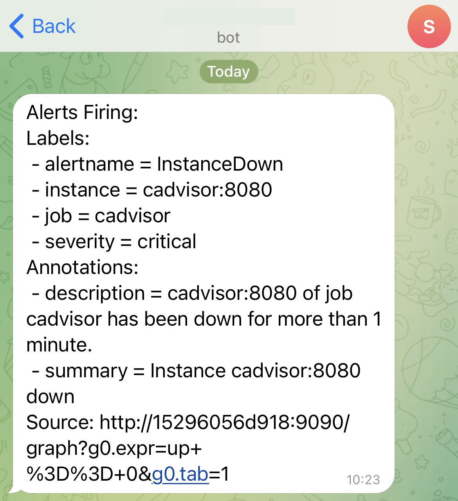
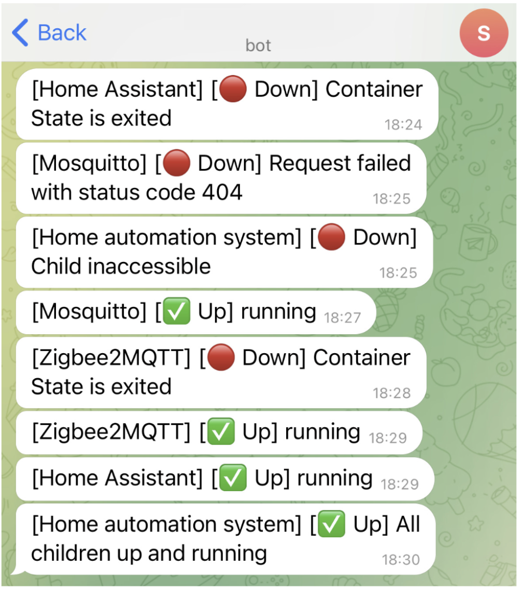

# ZeroTrust Your Home - A safe and private environment for you and your data<!-- omit in toc -->

## Table of contents<!-- omit in toc -->

- [1. Motivation](#1-motivation)
- [2. Project description](#2-project-description)
- [3. Server architecture - six pillars](#3-server-architecture---six-pillars)
  - [3.1. Continuous monitoring and alerting system](#31-continuous-monitoring-and-alerting-system)
    - [3.1.1. Alerting rules](#311-alerting-rules)
    - [3.1.2. Service health monitoring](#312-service-health-monitoring)
    - [3.1.3. Example alerts](#313-example-alerts)
  - [3.2. Log management suite](#32-log-management-suite)
  - [3.3. Backup and restore suite](#33-backup-and-restore-suite)
    - [3.3.1. Backup retention policies](#331-backup-retention-policies)
    - [3.3.2. Backup notifications](#332-backup-notifications)
    - [3.3.3. Backup and restore operations via CLI](#333-backup-and-restore-operations-via-cli)
  - [3.4. Home automation system](#34-home-automation-system)
    - [3.4.1. ZigBee devices pairing tutorial](#341-zigbee-devices-pairing-tutorial)
    - [3.4.2.  ZigBee automation examples](#342-zigbee-automation-examples)
  - [3.5. Automatic updates](#35-automatic-updates)
  - [3.6. Network infrastructure](#36-network-infrastructure)
- [4. Additional services](#4-additional-services)
- [5. Testing the system](#5-testing-the-system)
- [6. Additional resources](#6-additional-resources)
  - [6.1. Docker containers network segmentation](#61-docker-containers-network-segmentation)

## 1. Motivation

Information systems play an increasingly key role in our daily lives, in sectors as diverse as public services, healthcare, finance, industry and more. Ensuring the security and privacy of systems is of critical importance as it protects the data of users and the integrity of the systems themselves.

## 2. Project description

This project showcases an autoconfigured home server environment that provides a powerful and secure infrastructure that leverages cutting-edge technologies to ensure security, privacy, and ease of use. It provides the user with a set of pre-configured services and applications that can be easily extended and customized to meet the user's needs.

Employing [Cloudflare SSE & SASE Platform](https://www.cloudflare.com/zero-trust/#zt-features), the server adheres with the Zero Trust security model, in fact, to be able to access the services the user needs to be authenticated, authorized and the device security must be verified through automated posture checks.

The developed infrastructure has been designed to be easily extensible and customizable. In fact, a user can easily extend the server with additional services and applications without any additional configuration.

## 3. Server architecture - six pillars

The server is based on six main components to provide a secure and private environment for the user data. In the following sections, each component will be described in detail to provide a better understanding of the server architecture.

The entire system is based upon [Docker](https://www.docker.com/) containers to leverage application virtualization, aiming to provide a secure and isolated environment for each application.

In the following sections, each component will be described in detail to provide a better understanding of the server architecture.

### 3.1. Continuous monitoring and alerting system

With a continuous monitoring solution system administrators can be notified in real-time when an issue is detected, allowing to respond quickly and effectively. For this purpose, the open-source monitoring solution *Prometheus* has been used in pair with *Grafana* to collect and visualize metrics of the operating system and the various *Docker* containers.

To provide real-time notifications, *Prometheus Alerts* have been configured to trigger alerts when specific system metrics exceeds a predefined threshold.

While *Prometheus* is charge of monitoring the status of the system and the running containers, *Uptime Kuma* has been employed to monitor the health of the many applications and services running on the server.

*Note: Grafana has been configured to automatically import the custom dashboards, without any additional configuration.*

#### 3.1.1. Alerting rules

Alerting rules are conditions evaluated periodically by *Prometheus* that whenever are met, it will trigger an alert via *Prometheus Alertmanager*. The alert manager will then notify the system administrators via the configured notification channels (i.e., Telegram, E-Mail, Slack).

The following list outlines the alerting rules configured to monitor the system health:

1. *Instance down*: triggers an alert when one of the core services of the monitoring suite (*Prometheus*, *Node Exporter* or *cAdvisor*) is down for more than 1 minute

2. *High disk usage*: triggers an alert when the disk usage of the host machine on ’/’ exceeds 80% for more than 10 minutes.

3. *High CPU usage*: triggers an alert when the CPU usage of the host machine exceeds 80% for more than 5 minutes.

4. *High network traffic*: triggers an alert when the inbound network traffic of the host machine exceeds 10Mb/s for the last minute.

5. *High CPU temperature*: triggers an alert when the CPU temperature of the host machine exceeds 70 °C for more than 1 minute.

For the particular use case thought for this project, Telegram has been chosen as notification channel as it provides the most convenient solution. The individuals using the services hosted on the system are not expected to have technical skills and is not expected to have business accounts on other platforms such as Slack or WeChat.

#### 3.1.2. Service health monitoring

*Uptime Kuma* allows to monitor the status of the applications and services of the system and to receive real-time notifications when a service is down. The uptime check is performed by periodically sending requests (i.e. HTTP, TCP, ICMP) to the monitored targets and alerting the system administrator using the configured Telegram bot in case of failures.

To learn more about how *Uptime Kuma* has been configured to perform its purpose, please refer to this [file](./doc/uptime-kuma-monitoring.md).

#### 3.1.3. Example alerts

The following image shows an example of an alert triggered by the *Instance Down* rule.

This is an example of a notification sent by *Uptime Kuma* when one of the monitored services is down.

### 3.2. Log management suite

A log management solution has been implemented to centralize the collection, storage, and visualization of logs of the system services and Docker containers. The centralization of logs enables system administrators to access, query and visualize logs of different components of the system from a single interface, simplifying the process of troubleshooting and debugging of the system.

The following image illustrates the architecture of the log management suite.

*Promtail* is configured to collect logs from the system and the running *Docker* containers and to send them to *Loki* for storage and indexing. All the stored logs can be accessed via the *Explore* section of the Grafana web interface (yes, all out-of-the-box!).

### 3.3. Backup and restore suite

To ensure data integrity in case of disasters such as hardware failures or physical damage, a robust backup solution has been implemented to periodically backup critical data stored in the system.

The use of a cloud storage solution like Amazon S3 (the one supported by default) is recommended as it provides a cheap and reliable solution to archive backups without incurring in disk capacity issues.

The following image illustrates the architecture of the backup and restore suite.

In the figure is possible to notice that are present three different instances of *Restic* running at the same time. Each instance has a different purpose and is configured to perform specific tasks at specific times:

1. The *backup* instance: configured to perform daily backups of the Docker volumes (every day at midnight). To guarantee data confidentiality, backups are encrypted before being sent to the cloud storage.

2. The *restore* instance: in charge of cleaning up the S3 bucket by removing old backups based on the configured retention policies (refer to the next section for more details).

3. The "check" instance: is responsible for verifying the integrity of the backup repository stored in the S3 bucket. This operation is executed on a daily basis (every day at 5:15 AM, 1h15m after the prune operation). The check process consists in analyzing 10% of the total data stored in the cloud storage, ensuring the reliability and integrity of the backups.

#### 3.3.1. Backup retention policies

Retention policies ensure the retention of a specific number of backups, while removing the oldest one as the limit is reached. These are the configured retention policies:

- Keep last seven daily backups
- Keep last four weekly backups
- Keep last twelve monthly backups

#### 3.3.2. Backup notifications

Leveraging Telegram APIs, the *Restic* is able to notify administrators when a backup operation is completed, when fails (i.e., S3 bucket unavailable) or when it is interrupted (i.e., one or more files are unreadable).

The following image shows all the possible notifications sent by the backup instance.

#### 3.3.3. Backup and restore operations via CLI

To simplify the backup and restore operations, a Makefile script has been developed to automate the backup and restore procedures as much as possible.

The following commands are available:

- *make backup*: creates a new incremental backup of the *Docker* volumes and sends it to the S3 bucket.

- *make restore*: wizard to restore the system from a backup selected by the user from the list of available backups. After the backup is performed, it will check the integrity of the restored data to ensure the integrity of the restored data.

*Note: it is important to note that the restore command first shuts down all running Docker containers, then restores the selected backup, and finally restarts all containers to ensure the integrity of the data.*

### 3.4. Home automation system

WIP: Already implemented but not added to the project yet. The developed home automation system is based on Home Assistant and supports out-of-the-box the following kind of devices:

- ZigBee devices
- Ethernet devices
- Wi-Fi devices
- Bluetooth devices

*Note: to be able to use the ZigBee devices, the user needs to have a ZigBee USB dongle. The recommended one is the [Sonoff ZigBee 3.0 USB Dongle Plus](https://sonoff.tech/product/gateway-and-sensors/sonoff-zigbee-3-0-usb-dongle-plus-p/)*

#### 3.4.1. ZigBee devices pairing tutorial

#### 3.4.2.  ZigBee automation examples

### 3.5. Automatic updates

### 3.6. Network infrastructure

## 4. Additional services

- Vaultwarden
- Nextcloud
- Personal website (as example of possible additional services)

## 5. Testing the system

## 6. Additional resources

### 6.1. Docker containers network segmentation

The following diagram shows the network segmentation of the Docker containers used by the server.

