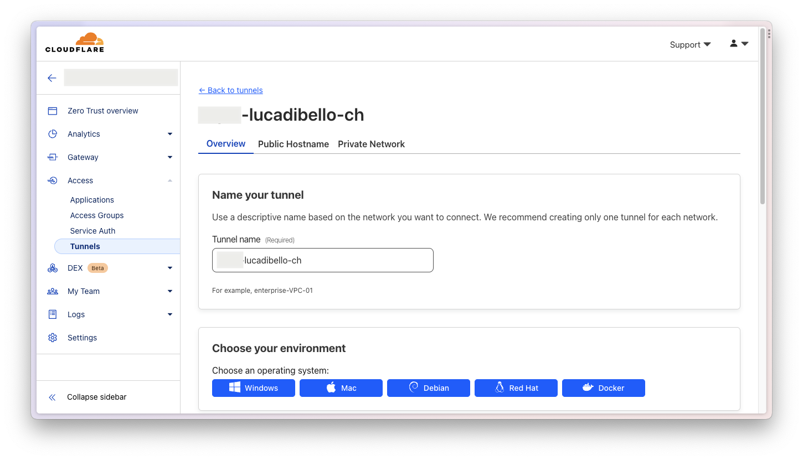
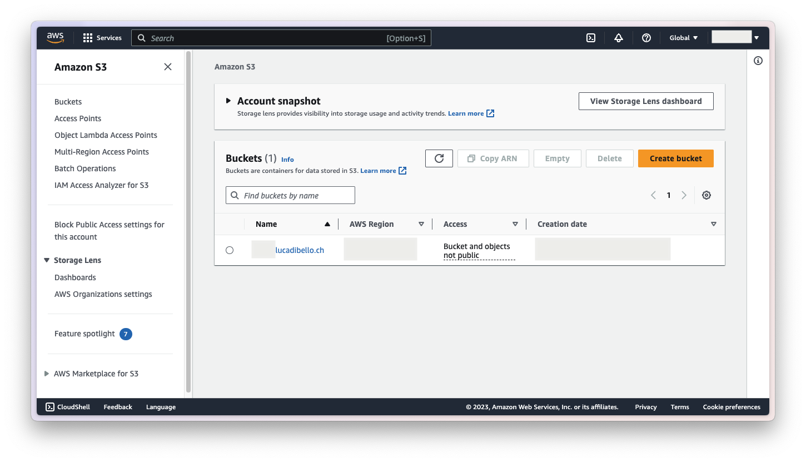
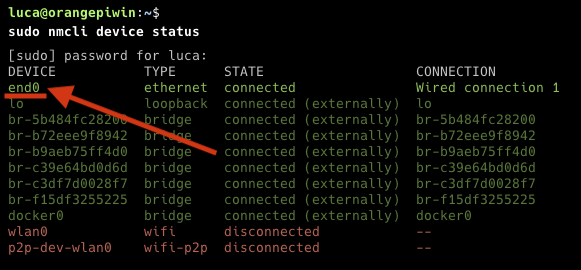

# ZeroTrust Your Home - Getting Started guide<!-- omit in toc -->

In this document, you can find instructions for deploying the home automation system on a remote server. It is important to note that the user requires sudo privileges on the remote server and the server must have SSH access enabled.

> Note: the following instructions are tested on a remote server running Armbian 21.08.1 Buster with Linux kernel 5.10.60-sunxi64. Different OS (e.g. Ubuntu) or Linux kernel versions may require slightly different configurations.


## Table of Contents<!-- omit in toc -->

- [1.1.1. Define system parameters](#111-define-system-parameters)
- [1.1.2. Create a Zero Trust Tunnel on Cloudflare](#112-create-a-zero-trust-tunnel-on-cloudflare)
- [1.1.3. Create an S3 bucket on AWS and configure AWS IAM](#113-create-an-s3-bucket-on-aws-and-configure-aws-iam)
- [1.1.4. Create a Telegram bot](#114-create-a-telegram-bot)
- [1.1.5. Install Armbian on the remote server](#115-install-armbian-on-the-remote-server)
- [1.1.6. Clone the repository locally](#116-clone-the-repository-locally)
- [1.1.7. Create .env file](#117-create-env-file)
  - [1.1.7.1. Variable **ZIGBEE2MQTT\_DEVICE**](#1171-variable-zigbee2mqtt_device)
  - [1.1.7.2. Variable **IF**](#1172-variable-if)
  - [1.1.8. Deploy the project to a remote server](#118-deploy-the-project-to-a-remote-server)
  - [1.1.9. Start the configuration script on the remote server](#119-start-the-configuration-script-on-the-remote-server)
  - [1.1.10. Start docker containers on the remote server](#1110-start-docker-containers-on-the-remote-server)
  - [1.1.11. Configure Home Assistant MQTT integration](#1111-configure-home-assistant-mqtt-integration)
- [1.2. Backup and Restore operations](#12-backup-and-restore-operations)
  - [1.2.1. View available backups](#121-view-available-backups)
  - [1.2.2. Manual backup](#122-manual-backup)
  - [1.2.3. Restore Docker volumes from backup](#123-restore-docker-volumes-from-backup)
- [1.3. Configuration file](#13-configuration-file)
  - [1.3.1. Ethernet interface settings](#131-ethernet-interface-settings)
  - [1.3.2. Wireless hotspot settings](#132-wireless-hotspot-settings)
  - [1.3.3. Firewall settings](#133-firewall-settings)
  - [1.3.4. Cloudflare API settings](#134-cloudflare-api-settings)
  - [1.3.5. Backup and Restore settings](#135-backup-and-restore-settings)
  - [1.3.6. Telegram bot settings](#136-telegram-bot-settings)
  - [1.3.7. Cloudflare Tunnel settings](#137-cloudflare-tunnel-settings)
  - [1.3.8. DNS settings](#138-dns-settings)
  - [1.3.9. Zigbee2MQTT settings](#139-zigbee2mqtt-settings)
  - [Clustering settings](#clustering-settings)

## 1.1.1. Define system parameters

The first step is to define the parameters of the system. The user must acquire the following information before starting the configuration process:

- Static IPv4 address of the Ethernet interface
- IPv4 address of the gateway
- Subnet mask
- DNS server address
- Internal domain name used by the internal services
- Email address of the DNS administrator
- Email address of the Cloudflare account

## 1.1.2. Create a Zero Trust Tunnel on Cloudflare

First of all, the user must create a Zero Trust Tunnel on Cloudflare. To do this, the user must have the following prerequisites:

- Domain name registered / managed by Cloudflare DNS
- Cloudflare account with the domain name configured
- Cloudflare Zero Trust account connected to the Cloudflare account

To create a Cloudflare Tunnel, follow the steps outlined in the [official documentation](https://developers.cloudflare.com/cloudflare-one/connections/connect-networks/install-and-setup/tunnel-guide/remote/).



After the Cloudflare Tunnel is created, the user must retrieve the Tunnel token from the Cloudflare dashboard to later configure the home automation system.

## 1.1.3. Create an S3 bucket on AWS and configure AWS IAM

To store the backups, the user must create an S3 bucket on AWS with the correct permissions. As this project uses the *restic* backup tool, the user must follow the steps outlined in the [official documentation](https://restic.readthedocs.io/en/latest/080_examples.html) to create an S3 bucket and configure the AWS IAM user.



## 1.1.4. Create a Telegram bot

This step is necessary to receive notifications from the *alertmanager*, *uptime-kuma*, *watchtower* and *restic* services. To create a Telegram bot, follow the steps outlined in the [official documentation](https://core.telegram.org/bots#how-do-i-create-a-bot). After the bot is created, the user must retrieve the bot token and the chat ID to later configure the home automation system.

A more detailed guide is available in the paper.

## 1.1.5. Install Armbian on the remote server

This first step is necessary only if the user does not have a remote server with Armbian already installed. To install and configure Armbian on the remote server, perform the following steps:

1. Download the Armbian image for your board from the [official website](https://www.armbian.com/download/)
2. Flash the image to an SD card using [Balena Etcher](https://www.balena.io/etcher/)
3. Insert the SD card into the remote server and power it on
4. Connect to the remote server via SSH using the default credentials:
   - Username: root
   - Password: 1234
5. Complete the first boot wizard and reboot the system when prompted

Now, the remote server is ready to be configured to run the home automation system.

## 1.1.6. Clone the repository locally

First, clone the repository locally to your machine and navigate to the project directory.

```bash
git clone git@github.com:lucadibello/iot-security-guidelines.git
cd iot-security-guidelines/project
```

## 1.1.7. Create .env file

Then, create a .env file and fill the variables with the correct values.

```bash
cp .env.example .env
```

### 1.1.7.1. Variable **ZIGBEE2MQTT_DEVICE**

Note: the value of the variable *ZIGBEE2MQTT_DEVICE* must be the path to the mounted Zigbee adapter. To find the path, run the following command on the remote server:

```bash
ls /dev/serial/by-id
```


### 1.1.7.2. Variable **IF**

Note: the value of the variable *IF* must be the name of the Ethernet interface. To find the name of the Ethernet interface, run the following command on the remote server:

```bash
sudo nmcli device status
```



### 1.1.8. Deploy the project to a remote server

The following script deploys the project to a remote server using *scp*. The script copies the 'project' directory to the remote server.

```bash
./deploy.sh <USER> <IP_ADDRESS>
```

With this configuration, the user is able to send the project files to a remote server without the need to configure Git SSH keys. After the deployment, the user can connect to the remote server via SSH and start the configuration script.

*Note: the user must have sudo privileges to be able to perform the next steps.*

### 1.1.9. Start the configuration script on the remote server

To configure the Armbian-based server, the user must connect to the remote server via SSH and start the configuration script manually. The configuration script performs the following operations:

```bash
ssh <USER>@<IP_ADDRESS>
unzip project.zip
sudo ./configure.sh
```

*Note: do not use root user to run the configuration script as root access from SSH will be disabled during the configuration process.*

This configuration script performs the following operations:

- Install system dependencies using APT
- Starts required system services
- Performs additional system services configurations
- Overrides the default NTP servers (if necessary)
  - *Note: It is necessary only when the internal DNS server is configured as the sole DNS server of the system (no secondary external DNS servers)*
- Prepares the Docker environment to run the home automation system by creating Docker networks, volumes and configuration files
- Generates TLS certificates for the internal services
- Configure the IPTables firewall rules to adhere to the Zero Trust model
- Performs system hardening operations
  - *Note: to learn more, refer to the paper*
- Apply network configurations to the Ethernet interface
- Create a wireless hotspot (if enabled and supported by the hardware)

### 1.1.10. Start docker containers on the remote server

After the remote server is configured, the user can start the Docker containers by running the following command:

```bash
make start
```

### 1.1.11. Configure Home Assistant MQTT integration

Unfortunately, due to breaking changes in the Home Assistant MQTT integration (view report [here](https://www.home-assistant.io/blog/2023/04/05/release-20234/#breaking-changes)) it is necessary to manually configure the MQTT integration via the Home Assistant UI (configuration file *configuration.yaml* is not supported anymore). To perform this operation, the user must have on hand the certificate and the private key of the MQTT client generated by the configuration script. To retrieve the certificate and the private key, run the following command:

```bash
scp -O <USER>@<IP_ADDRESS>:~/composes/home-assistant/certs/certs.zip .
```

Inside this zip file, there are three files:

1. *ca.crt*: CA certificate
2. *hass-service.crt*: client certificate
3. *hass-service.key*: client private key


To install the MQTT integration, perform the following steps:

- Enable advanced mode in the Home Assistant UI (Profile -> Advanced Mode)
- Navigate to the integrations page (Settings -> Integrations)q
- Click on the "Add Integration" button
- Search for "MQTT" and select the "MQTT" integration
- From the list of available MQTT integrations, select the "MQTT" integration (top of the list)

Now, the user must fill the form with the following values:

- Broker: mosquitto
- Port: 8883
- Username: leave empty
- Password: leave empty
- Advanced options: true

Click on the "Submit" button and fill the next page with the following values:

- Client ID: home-assistant
- Keep-alive: 60
- Use a client certificate: true
  - Upload the client certificate *hass-service.crt* (copied before)
  - Upload the client private key *hass-service.key* (copied before)
- Broker certificate validation: custom
  - Upload the CA certificate *ca.crt* (copied before)
- MQTT version: 5.0
- MQTT transport: TCP
- Enable discovery: true
  - Prefix: homeassistant
- Enable birth message: true
  - Topic: homeassistant/status
  - Payload: online
  - Birth message QoS: 0
- Birth message retain: false
- Enable last will and testament: true
  - Topic: homeassistant/status
  - Payload: offline
  - Last will QoS: 0
- Will message retain: false
- Press the "Submit" button

## 1.2. Backup and Restore operations

To simplify the backup and restore operations, a Makefile is provided. In the following sections, you can find the available commands to perform management operations.

### 1.2.1. View available backups

This command allows the user to view the available system backups stored in the S3 bucket.

```bash
make view-backups
```

### 1.2.2. Manual backup

This command allows the user to perform a manual backup of the Docker volumes. The backup is encrypted and stored in the S3 bucket.

```bash
make backup
```

*Note: a backup is performed automatically every day at 00:00, this command is useful only if the user wants to perform a manual backup before critical operations.*

### 1.2.3. Restore Docker volumes from backup

With the following command, the user can restore the Docker volumes from a backup. The entire operation is guided via a wizard, the user must select the snapshot to restore from the list of available snapshots.

```bash
make restore
```

*Note: this command is useful only if the user wants to restore the Docker volumes from a backup. It automatically stops all the running Docker containers, restores the volumes and starts the containers again to apply the changes.*

## 1.3. Configuration file

The configuration file is a .env file that contains all the variables used by the configuration script. The following sections describe the variables that can be set in the configuration file.

### 1.3.1. Ethernet interface settings

The following variables are used to configure the Ethernet interface.

| Variable | Description |
| --- | --- |
| IP_ADDRESS | Static IPv4 address of the Ethernet interface |
| IP_GATEWAY | IPv4 address of the gateway |

### 1.3.2. Wireless hotspot settings

The following variables are used to configure the wireless hotspot (if supported by the hardware)

| Variable | Description |
| --- | --- |
| ENABLE_HOTSPOT | Enable the wireless hotspot (true/false) |
| HOTSPOT_SSID | SSID of the wireless hotspot |
| HOTSPOT_PASSWORD | Password of the wireless hotspot |

### 1.3.3. Firewall settings

The following variables are used to configure the Zero Trust Firewall. By adhering to the Zero Trust model, the firewall blocks all incoming connections by default and allows only connections from Cloudflare's Edge network.

These options are useful if the user wants to adhere as much as possible to the Zero Trust model, but keeping the possibility to access the server from the local network.

| Variable | Description |
| --- | --- |
| IF | Ethernet interface name (in Armbian by default is "end0") |
| LOCAL_NETWORK | Local network CIDR (e.g. 192.168.0.0/24) |
| ALLOW_LOCAL_SSH_ACCESS | Allow SSH access from the local network (true/false) |
| ALLOW_LOCAL_SERVICES_ACCESS | Allow access to local services from the local network (true/false) |

### 1.3.4. Cloudflare API settings

The following variables are used to configure the credentials of the Cloudflare account. These credentials are used by *Traefik* reverse proxy to perform DNS challenges for the Let's Encrypt certificates.

| Variable | Description |
| --- | --- |
| CLOUDFLARE_EMAIL | Email address of the Cloudflare account |
| CLOUDFLARE_API_KEY | API key of the Cloudflare account |

### 1.3.5. Backup and Restore settings

The following variables are used to configure the backup and restore operations. These variables are used by the *restic* backup tool to perform the backup and restore operations.

| Variable | Description |
| --- | --- |
| RESTIC_REPOSITORY | S3 bucket path where the backups are stored |
| RESTIC_PASSWORD | Password used to encrypt the backups |
| AWS_DEFAULT_REGION | AWS region of the S3 bucket |
| AWS_ACCESS_KEY_ID | AWS access key ID |
| AWS_SECRET_ACCESS_KEY | AWS secret access key |

### 1.3.6. Telegram bot settings

The following variables are used to configure the Telegram bot. These variables are used by the *alertmanager*, *uptime-kuma*, *watchtower* and *restic*  to send notifications to the Telegram bot.

| Variable | Description |
| --- | --- |
| TELEGRAM_BOT_TOKEN | Telegram bot token |
| TELEGRAM_CHAT_ID | Telegram chat ID |

### 1.3.7. Cloudflare Tunnel settings

The following variables are used to configure the Cloudflare Tunnel. These variables are used by the *cloudflared* tool to create a secure tunnel between the local network and the Cloudflare Edge network.

| Variable | Description |
| --- | --- |
| TUNNEL_TOKEN | Cloudflare Zero Trust Tunnel token |

### 1.3.8. DNS settings

The following variables are used to configure the DNS server. These variables are used to configure the DNS server and the internal services domain names.

| Variable | Description |
| --- | --- |
| DNS_DOMAIN | Internal domain name used by the internal services |
| DNS_EMAIL | Email address of the DNS administrator |

### 1.3.9. Zigbee2MQTT settings

The following variables are used to configure the Zigbee2MQTT adapter. These variables are used to configure the Zigbee2MQTT adapter and the Zigbee2MQTT gateway.

| Variable | Description |
| --- | --- |
| ZIGBEE2MQTT_DEVICE | Path to the mounted Zigbee2mqtt adapter |
| ZIGBEE2MQTT_GATEWAY_ID | ID of the Zigbee2mqtt gateway |


### Clustering settings

To be able to group multiple home automation systems in a cluster, where each system is a node of the cluster and the data generated by the nodes is stored in a centralized database, the user must configure the following variables:

| Variable | Description |
| --- | --- |
| ENABLE_CLUSTER | Enable clustering (true/false) |
| CLUSTER_NAME | Name of the cluster in which the node is part of |
| NODE_NAME | Name of the node in the cluster |
| MASTER_NODE_DOMAIN | Domain name of the master node running RabbitMQ |
| MASTER_NODE_PASSWORD | Password of the master node running RabbitMQ |
| MASTER_NODE_USERNAME | Username of the master node running RabbitMQ |

By enabling clustering, the configuration scripts automatically configures *grouper* service to exfiltrate MQTT messages to the master node running RabbitMQ. This allows to group data from multiple nodes in a centralized database to perform data analysis and machine learning operations.