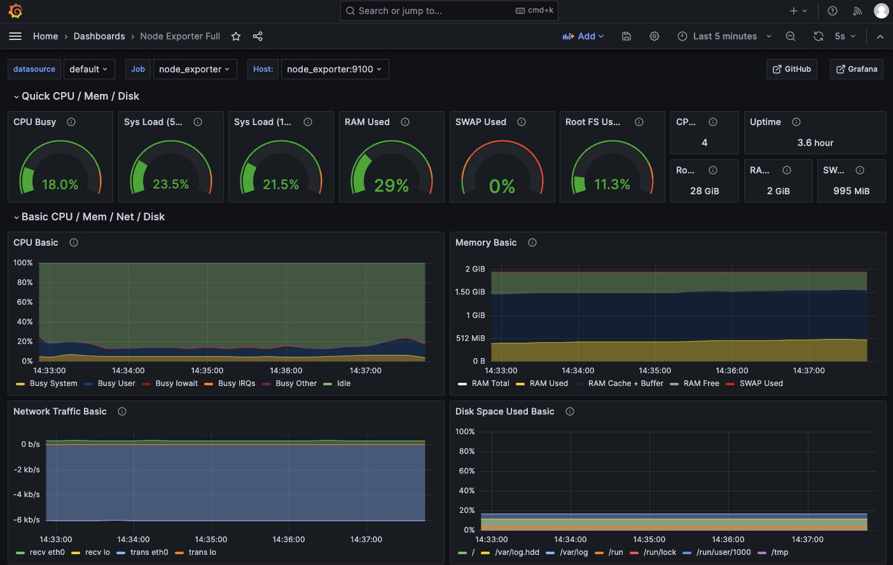
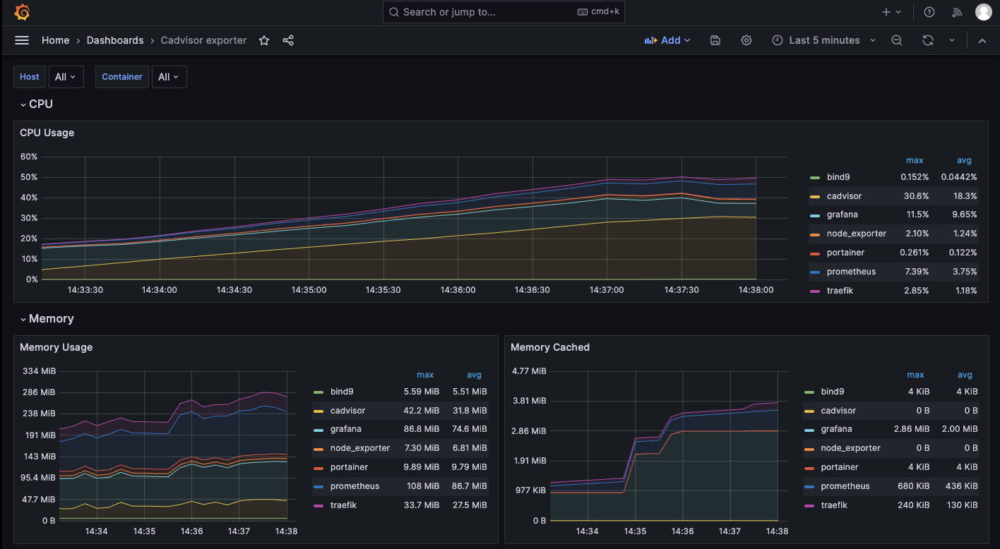

# Grafana Dashboards

Grafana has been preconfigured to offer to users two default preconfigured dashboards. Through the first dashboard, titled [Node Exporter Full](https://grafana.com/grafana/dashboards/1860), the user is able to visualize the metrics collected by the *Node Exporter* Prometheus exporter instance.

On the other hand, to visualize the metrics collected by the *cAdvisor* Prometheus exporter instance, the user could use
[cAdvisor Exporter](https://grafana.com/grafana/dashboards/193) dashboard.

